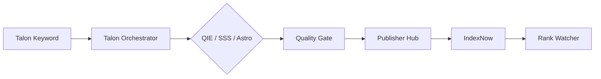

# HIVE Platform — Kapsamlı Teknik ve Operasyonel Rehber

> **Versiyon:** HIVE Panel 3.0  
> **Canlı panel:** https://hive.thiqos.com  
> **Repo:** `thatteknoloji/hive-platform`  
> **Son güncelleme:** Haziran 2026

Bu doküman HIVE SEO OS platformunun tek kaynaklı (single source of truth) referansıdır. Modül modül ne yaptığı, ne yapmadığı, firma/proje nasıl eklenir, veri nerede durur ve uçtan uca iş akışları burada anlatılır.

---

## İçindekiler

1. [HIVE Nedir?](#1-hive-nedir)
2. [HIVE Ne Değildir?](#2-hive-ne-değildir)
3. [Mimari Genel Bakış](#3-mimari-genel-bakış)
4. [Firma / Proje Kavramı ve Ekleme](#4-firma--proje-kavramı-ve-ekleme)
5. [Aktif Proje Bağlamı (Active Project Context)](#5-aktif-proje-bağlamı-active-project-context)
6. [Kimlik Doğrulama ve Roller](#6-kimlik-doğrulama-ve-roller)
7. [Panel Navigasyonu: HIVE OS vs Klasik Modüller](#7-panel-navigasyonu-hive-os-vs-klasik-modüller)
8. [Modül Kayıt Defteri](#8-modül-kayıt-defteri)
9. [Modül Ansiklopedisi (Grup Grup)](#9-modül-ansiklopedisi-grup-grup)
10. [HIVE OS Özel Motorları (liste.py Dışı)](#10-hive-os-özel-motorları-listepy-dışı)
11. [V3 Proje Motoru ve Yayın Pipeline'ı](#11-v3-proje-motoru-ve-yayın-pipelineı)
12. [Ana İş Akışları](#12-ana-iş-akışları)
13. [Veri Depolama ve State Dosyaları](#13-veri-depolama-ve-state-dosyaları)
14. [API Yapısı](#14-api-yapısı)
15. [Deployment (Canlıya Alma)](#15-deployment-canlıya-alma)
16. [Ortam Değişkenleri](#16-ortam-değişkenleri)
17. [Sık Sorulan Sorular](#17-sık-sorulan-sorular)
18. [Hızlı Başlangıç Checklist](#18-hızlı-başlangıç-checklist)

---

## 1. HIVE Nedir?

**HIVE**, Thiqos tarafından geliştirilen bir **SEO Operating System (SEO OS)** — yani tek panelden yönetilen, modüler bir SEO komuta merkezidir.

HIVE şunları bir arada sunar:

| Katman | Açıklama |
|--------|----------|
| **Komuta** | Mission Control, Executive AI, Autonomous Agent — tüm motorların özeti ve karar katmanı |
| **Keşif** | Talon, Crawl Gap, Opportunity Engine — keyword, rakip, gap analizi |
| **İçerik** | QIE, Astro Factory, StoryForge, Publisher Hub — üretim ve yayın |
| **Otorite** | Authority Mesh, Network Replicator — çoklu domain/platform ağı |
| **İzleme** | Rank Watcher, SERP Defense, Content Refresh — performans ve savunma |
| **Altyapı** | WordPress Manager, Domain Manager, Replicator — site ve domain operasyonları |

### Temel bileşenler

```
┌─────────────────────────────────────────────────────────────┐
│  Tarayıcı → hive.thiqos.com (React Panel)                   │
│     │                                                       │
│     ├─ /              → frontend/build (statik SPA)         │
│     ├─ /api/*         → FastAPI backend (port 4001)         │
│     └─ /sites/*       → HIVE Cloud statik site çıktıları    │
└─────────────────────────────────────────────────────────────┘
```

- **Backend:** Python FastAPI — `backend/app/main.py`
- **Frontend:** React — `frontend/src/`
- **Modüller:** `backend/app/moduller/` altında ~180 Python dosyası
- **Kayıtlı panel modülleri:** `liste.py` içinde **116 modül** (9 grup + Black Ops)

---

## 2. HIVE Ne Değildir?

HIVE'ı doğru kullanmak için sınırlarını bilmek önemlidir:

| HIVE değildir | Açıklama |
|---------------|----------|
| **CRM / ERP** | Müşteri faturalama, muhasebe, HR yönetimi yapmaz |
| **Hosting paneli** | cPanel/Plesk alternatifi değil; domain DNS'i sınırlı kapsamda yönetir |
| **Tek tıkla sıra garantisi** | SEO sonuçları garanti etmez; araçlar ve otomasyon sağlar |
| **İlan sitesi** | Listing Hub ilan CRUD yapar ama Place SEO / Entity Detail **ilan değil**, otorite içeriği üretir |
| **Tam otomatik Black Hat güvencesi** | Black Ops modülleri eğitim/operasyon amaçlıdır; yasal risk kullanıcıya aittir |
| **Tek müşteri = tek repo** | Bir GitHub hesabında birden fazla proje olabilir; her HIVE **projesi** ayrı domain/bağlamdır |

---

## 3. Mimari Genel Bakış

### 3.1 Katmanlar

```
Kullanıcı (SEO Manager / Admin)
        │
        ▼
┌───────────────────┐
│  React Panel UI   │  ← ActiveProjectContext, HiveOsSidebar, sayfa bileşenleri
└─────────┬─────────┘
          │ JWT / API Key
          ▼
┌───────────────────┐
│  FastAPI Gateway  │  ← RBAC middleware, rate limit, brain hooks
└─────────┬─────────┘
          │
    ┌─────┴─────┬─────────────┬──────────────┐
    ▼           ▼             ▼              ▼
 Modüller   project_engine  panel_identity  integrations
 (liste.py)  (V3 CRUD)      (users/RBAC)    (OpenSEO, SerpBear…)
    │           │             │
    └─────┬─────┴─────────────┘
          ▼
   JSON state dosyaları + hive_data.json log
          │
          ▼
   Dış servisler: WP REST, Cloudflare, DataForSEO, Ollama, Tavily, GSC…
```

### 3.2 Modül çalışma döngüsü

1. Kullanıcı panelden modülü tetikler veya API çağrısı yapar
2. `main.py` ilgili Python fonksiyonunu çalıştırır
3. Sonuç `hive_data.json` içine loglanır (`log_module_run`)
4. İsteğe bağlı: HIVE Brain'e olay yazılır (`brain_hooks`)
5. Mission Control timing kaydı tutulur

### 3.3 Proje bağlamı

Çoğu modül artık **aktif projeden** domain/site URL çözer:

- `project_context.resolve_domain()` → aktif projenin domain'i
- `project_context.resolve_site_url()` → `https://domain` formatı
- Manuel domain girilmemişse üst bardaki proje seçiciden gelen değer kullanılır

---

## 4. Firma / Proje Kavramı ve Ekleme

### 4.1 Terminoloji

HIVE kodunda **"firma"** diye ayrı bir entity yoktur. Operasyonel birim:

> **Proje (Project)** = Bir müşteri sitesi, kampanya veya domain bağlamı

Bir ajans 10 müşteriyi yönetiyorsa → 10 ayrı HIVE projesi.

### 4.2 Proje alanları

| Alan | Zorunlu | Açıklama |
|------|---------|----------|
| `name` | Evet | Proje adı (ör. "Balkutusu") |
| `sector` | Evet | Sektör paketi ID (ör. `nightlife`, `restaurant`) |
| `domain` | Hayır | Hedef site (ör. `balkutusu.com`) |
| `business_brief` | Hayır | İş tanımı / ton / hedef kitle |
| `design` | Hayır | Renk, font, creative brief |
| `deploy_mode` | Hayır | `hive_cloud` / `customer_agent` / `enterprise_agent` |
| `status` | Otomatik | `draft` → `building` → `active` / `paused` / `error` |

### 4.3 Firma (proje) ekleme — UI adımları

1. **Panele giriş yap** → https://hive.thiqos.com
2. Sol üst veya **Projects** (`/projects`) menüsüne git
3. **"Yeni Proje"** / **Project Wizard** (`/projects/new`) aç
4. Formu doldur:
   - Proje adı
   - Sektör seç (sector pack listesi API'den gelir)
   - Domain (opsiyonel ama modüller için kritik)
   - İş özeti (business brief)
   - Deploy modu seç
5. **Oluştur** → Backend `site_seed.build_site_skeleton()` ile sayfa iskeleti üretir
6. Proje detay sayfasında (`/projects/{id}`):
   - CMS editör ile sayfa/blok düzenle
   - Creative Director önerisi al
   - Export → Build → Publish zincirini çalıştır
7. **Aktif proje yap:** Üst bardan projeyi seç veya `POST /api/v3/projects/{id}/set-active`

### 4.4 Firma ekleme — API

```http
POST /api/v3/projects
Authorization: Bearer <JWT>
Content-Type: application/json

{
  "name": "Örnek Firma",
  "sector": "nightlife",
  "domain": "ornekfirma.com",
  "business_brief": "Kuşadası gece hayatı rehber sitesi",
  "deploy_mode": "hive_cloud",
  "status": "draft"
}
```

**Yanıt:** `{ "success": true, "project": { "id": "prj-xxxxxxxxxx", ... } }`

Aktif yapmak için:

```http
POST /api/v3/projects/prj-xxxxxxxxxx/set-active
```

### 4.5 Proje oluşturulunca ne olur?

```
create_project()
    │
    ├─ project_engine_state.json'a kayıt
    ├─ site_seed.build_site_skeleton(sector) → varsayılan sayfalar
    ├─ block_seed.fill_blocks() (isteğe bağlı LLM ile)
    ├─ seo_score / geo_score hesaplama
    └─ status: draft
```

**Oluşmaz:**
- Otomatik DNS kaydı
- Otomatik SSL
- Otomatik canlı yayın (publish ayrı adım)

### 4.6 Deploy modları

| Mod | Anlamı |
|-----|--------|
| `hive_cloud` | HIVE'ın kendi `/sites/` altyapısına statik deploy |
| `customer_agent` | Müşteri sunucusuna agent/script ile deploy |
| `enterprise_agent` | Kurumsal nginx/VPS planı + apply script |

### 4.7 Kullanıcı–proje ilişkisi

`panel_identity_state.json` içinde her kullanıcının `allowed_projects` alanı vardır:

- `["*"]` → tüm projelere erişim (super_admin)
- `["prj-abc", "prj-def"]` → sadece belirtilen projeler

---

## 5. Aktif Proje Bağlamı (Active Project Context)

### 5.1 Neden var?

Önceden her modül kendi domain alanını manuel dolduruyordu. V3 ile **tek aktif proje** tüm modüllere domain sağlar.

### 5.2 Teknik akış

```
panel_identity_state.json
    └── active_project_id: "prj-xxx"
              │
              ▼
project_context.get_active_project_id()
              │
              ▼
project_engine.get_project(id) → domain, sector, site...
              │
              ▼
Modüller: resolve_domain(), resolve_site_url()
```

### 5.3 Frontend

- `frontend/src/context/ActiveProjectContext.js` — React context
- `frontend/src/hooks/useProjectSiteField.js` — form alanlarında otomatik domain doldurma
- Proje değişince `hive-active-project-changed` event'i tetiklenir

### 5.4 Legacy migrasyon

Eski `active_project_id` formatları `legacy_project_migration.py` ile temizlenir.

---

## 6. Kimlik Doğrulama ve Roller

### 6.1 Giriş yöntemleri

| Yöntem | Kullanım |
|--------|----------|
| **JWT (Bearer)** | Panel kullanıcı girişi — `POST /api/auth/login` |
| **X-API-Key** | Otomasyon/script — `HIVE_API_KEY` env ile eşleşmeli |

### 6.2 Roller ve yetkiler

| Rol | Yetki özeti |
|-----|-------------|
| `super_admin` | Her şey (`*`) |
| `admin` | Dashboard, kampanya, SEO core, projeler, publisher, authority |
| `seo_manager` | Kampanya, SEO core, rank watcher, citation, authority (sınırlı) |
| `editor` | İçerik, publisher hub, data miner |
| `viewer` | Sadece dashboard ve raporlar |

### 6.3 Route koruması

`panel_identity.py` içindeki `ROUTE_PERMISSIONS` listesi API path'lerini modül yetkilerine bağlar. Yetkisiz istek → **403 Forbidden**.

### 6.4 İlk admin oluşturma

Production `.env`:

```env
HIVE_ADMIN_EMAIL=admin@thiqos.com
HIVE_ADMIN_PASSWORD_HASH=<bcrypt hash>
HIVE_JWT_SECRET=<güçlü random>
```

Hash üretmek: `scripts/deploy/generate-admin-password-hash.py`

---

## 7. Panel Navigasyonu: HIVE OS vs Klasik Modüller

HIVE'da iki navigasyon katmanı vardır:

### 7.1 HIVE OS Sidebar (ana)

`frontend/src/config/hiveOsNav.js` — gruplar:

| Grup | Modüller |
|------|----------|
| **COMMAND** | Mission Control, HIVE Brain, Executive AI, Autonomous Agent, Action Orchestrator, Production Readiness, Users |
| **SEO CORE** | Talon, Rank Watcher, SERP Defense, Opportunity, Data Miner, Citation, Campaign, Crawl Gap |
| **CONTENT** | QIE, Content Refresh, Astro Factory, Astro Auto Publisher, Publisher Hub |
| **NETWORK** | Authority Mesh, Authority Factory, Revenue/Lead, Support Network, Network/Site Replicator |
| **WORKERS** | Google Sites, GitHub Pages, Blogger, Tumblr, WordPress |
| **LEARN** | Academy, Mentor, First Run Wizard, Success Path |
| **TOOLS** | API Settings, Provider Control, Audit Engine, Utilities, Diagnostics |

### 7.2 Klasik modül sidebar

`liste.py` içindeki 116 modül — gruplara göre (Analytics, Keşif, Müdahale, Savunma, İçerik, Sosyal, AI, Altyapı, Black Ops).

Özel sayfası olmayan modüller **ModulUI** generic panel ile açılır.

### 7.3 Black Ops

`blackops` modülü tüm saldırı modüllerini toplu aktifleştirir. Sidebar'da ayrı **BLACK FLAG** bölümü (`BlackModulePanel.js`).

---

## 8. Modül Kayıt Defteri

**Dosya:** `backend/app/moduller/liste.py`

- `GRUPLAR[]` → kategori + modül meta
- `MODULLER` → düz liste (endpoint, grup eklenmiş)
- `MODUL_MAP` → id → meta sözlüğü
- `MODUL_ENDPOINTS` → özel health/route override'ları

**Listeleme API:** `GET /api/moduller` → `{ toplam: 116, moduller: [...] }`

**Enable/disable:** Kayıt defterinde modül bazlı flag yok. Erişim RBAC ile kontrol edilir.

---

## 9. Modül Ansiklopedisi (Grup Grup)

Her modül için format:

- **Ne yapar**
- **Ne yapmaz**
- **Dosya**
- **Panel / Route**
- **Bağımlılıklar**

---

### 📈 Analytics & SEO

#### Rank & Index Watcher (`rank_index_watcher`)
- **Yapar:** Google indeks durumu, SERP sırası, GSC performans, AI Overview görünürlüğü, içerik decay tespiti
- **Yapmaz:** İçerik üretimi, otomatik publish
- **Dosya:** `rank_index_watcher.py` | **Route:** `/rank-watcher`
- **State:** `rank_index_watcher_state.json`

#### Entity & GEO Graph (`entity_geo_graph`)
- **Yapar:** Sayfa–lokasyon–entity–keyword ilişki grafiği; pillar/cluster haritası; GEO fırsat analizi
- **Yapmaz:** Site deploy, ilan oluşturma
- **Dosya:** `entity_geo_graph.py` | **Route:** `/entity-geo`

---

### 🔍 Keşif & Analiz

#### KEFEN — Catastrophe (`kefen`)
- **Yapar:** Rakip backlink profili analizi, BTK şikayet entegrasyonu, spam backlink tespiti
- **Yapmaz:** Yasal danışmanlık; otomatik Google ceza kaldırma
- **Route:** `/kefen`

#### Expired Domain Avcısı (`expireddomain`)
- **Yapar:** Domain müsaitlik, expiry, authority skoru, watchlist
- **Yapmaz:** Domain satın alma

#### Rank Tracker (`ranktracker`)
- **Yapar:** Günlük keyword sıra takibi (DataForSEO SERP + GSC)
- **Yapmaz:** İçerik optimizasyonu uygulama
- **Route:** `/ranktracker`

#### SEO Audit (`seoaudit`)
- **Yapar:** Site sağlık taraması, teknik SEO hata raporu
- **Yapmaz:** Otomatik düzeltme (Indexing Fix ayrı modül)

#### Keyword Research (`keywordresearch`)
- **Yapar:** Anahtar kelime hacim, zorluk, ilgili terim analizi

#### Competitor Intel (`competitor`)
- **Yapar:** Rakip domain strateji analizi

#### Web Scraper (`webscraper`)
- **Yapar:** HTTP/HTML kazıma — başlık, meta, link, görsel, metin
- **State:** `webscraper_state.json` | **Route:** `/webscraper`

#### OpenSEO (`openseo`)
- **Yapar:** Açık kaynak keyword research (volüm, CPC, zorluk)
- **Entegrasyon:** `openseo_integration.py` — in-process mock veya MCP

#### SerpBear (`serpbear`)
- **Yapar:** Açık kaynak rank tracker entegrasyonu

#### DataSEO (`dataseo`)
- **Yapar:** Backlink metrikleri, keyword ideas, traffic tahmini

#### SEOAgent (`seoagent`)
- **Yapar:** Site crawl + sayfa bazlı audit

#### API Hunter Ultra (`apihunter`)
- **Yapar:** Açıkta kalmış API key tespiti ve doğrulama
- **Route:** `/api-hunter`

#### Exposed Key Hunter (`exposedkeyhunter`)
- **Yapar:** Kingfisher ile GitHub secret taraması
- **Route:** `/exposed-keys`

---

### ⚔️ Müdahale & Saldırı (Black Flag)

> ⚠️ Bu modüller yasal ve etik risk taşır. HIVE eğitim/araştırma amaçlı sunar; kullanım sorumluluğu kullanıcıdadır.

#### Zeus (`zeus`)
- **Yapar:** Parasite SEO — Web 2.0 platformlara içerik yerleştirme
- **Route:** `/zeus`

#### Backlink Hijacker (`backlinkhijacker`)
- **Yapar:** Kırık backlink fırsatlarını hedef domain'e yönlendirme analizi

#### Spam Backlink (`spambacklink`)
- **Yapar:** Hedefe spam backlink kampanyası simülasyonu/operasyonu

#### Maps Saldırı Botu (`maps`)
- **Yapar:** Google Maps yorum gönderme otomasyonu

#### Yorum Botu (`yorum`)
- **Yapar:** Genel platform yorum botu

#### Phishing — Google Cloud (`phishing`)
- **Yapar:** Google Cloud üzerinden phishing sayfası operasyonu (penetrasyon testi bağlamı)

#### 0-Day Exploit Avcısı (`zeroday`)
- **Yapar:** WordPress plugin zafiyet taraması

#### Full Black Ops (`blackops`)
- **Yapar:** Tüm black modülleri toplu aktifleştirme/deaktifleştirme

---

### 🛡️ Savunma & İtibar

#### Mystic Return (`mystic`)
- **Yapar:** Spam backlink tespit, disavow dosyası, misilleme analizi
- **Route:** `/mystic`

#### Penalty Recovery Kit (`penalty`)
- **Yapar:** Google manual action / algoritmik ceza analizi, itiraz taslağı

#### DDoS Mitigation (`ddos`)
- **Yapar:** Saldırı tespit durumu ve öneriler

#### Veri Gizlilik (`veri`)
- **Yapar:** KVKK kapsamında veri sızıntısı tarama

#### Reputation Shield (`reputation`)
- **Yapar:** Marka itibarı izleme

#### Crisis Monitor (`crisis`)
- **Yapar:** Anlık itibar tehdit algılama

---

### 📝 İçerik & SEO (Ana Motorlar)

#### Topic Cluster Builder (`topiccluster`)
- **Yapar:** Pillar + cluster içerik mimarisi planı

#### Internal Link Optimizer (`internallink`)
- **Yapar:** İç link yapısı önerileri

#### Hyperlocal Hikaye Üretici (`hyperlocal`)
- **Yapar:** Yerel hikaye ve içerik üretimi

#### StoryForge (`storyforge`)
- **Yapar:** fastCRW scrape → LLM rewrite → WordPress yayın (V2/V3)
- **Dosyalar:** `storyforge_v2.py`, `storyforge_v3.py`, `storyforge_bulk.py`
- **Route:** StoryForge sayfaları

#### Indexing Accelerator (`indexing`)
- **Yapar:** Hızlı indeksleme isteği gönderimi

#### Content Generator (`contentgen`)
- **Yapar:** Şablon bazlı makale başlık/gövde üretimi

#### Auto Blog (`autoblog`)
- **Yapar:** RSS/API kaynaklı otomatik blog yazısı

#### Content Spinner (`spinner`)
- **Yapar:** Metin yeniden yazma (spin)

#### Translator (`translator`)
- **Yapar:** Çoklu dil çeviri

#### Schema Markup (`schemamarkup`)
- **Yapar:** JSON-LD yapısal veri üretimi

#### Speed Optimizer (`speedopt`)
- **Yapar:** Core Web Vitals iyileştirme önerileri

#### Mobile Checker (`mobilecheck`)
- **Yapar:** Mobil uyumluluk testi

#### Sitemap Generator (`sitemap`)
- **Yapar:** XML sitemap üretimi

#### Robots Manager (`robots`)
- **Yapar:** robots.txt düzenleme

#### Redirect Manager (`redirect`)
- **Yapar:** 301/302 yönlendirme yönetimi

#### IndexNow (`indexnow`)
- **Yapar:** Gerçek IndexNow API bildirimi (Bing, Yandex vb.)

#### Link Builder (`linkbuilder`)
- **Yapar:** Backlink inşa outreach simülasyonu

#### Backlink Hunter (`backlink_hunter`)
- **Yapar:** Rakip backlink fırsatı keşfi (ücretsiz provider'lar)

#### Competitor Backlink Hijacker (`competitor_hijacker`)
- **Yapar:** Rakip analiz → Hunter köprüsü

#### LinkSprayer (`linksprayer`)
- **Yapar:** Ollama ile AI yorum kampanyası

#### Directory Submitter (`directory_submitter`)
- **Yapar:** 120+ web dizinine toplu gönderim
- **Veri:** `backend/data/directories.json`

#### Internal Link Builder (`internal_link_builder`)
- **Yapar:** TF-IDF tabanlı iç link önerisi + WordPress'e uygulama

#### SEO Content Agent (`seo_content_agent`)
- **Yapar:** AI makale üret + WordPress'e yayınla

#### SSS Otomatik Zincir (`sss_automation`)
- **Yapar:** Talon → SSS üret → WordPress → IndexNow otomatik pipeline
- **Route:** `/sss-automation`

#### Astro Site Factory (`astro_factory`)
- **Yapar:** Talon + LLM verisiyle Astro statik site üretimi; npm build; Cloudflare/GitHub/VPS deploy talimatları
- **Route:** `/astro-factory`
- **Çıktı:** `generated-sites/{slug}/`

#### Astro Auto Publisher (`astro_auto_publisher`)
- **Yapar:** Kaynak tarama, Quality Gate, build, Cloudflare sync; startup'ta scheduler
- **Yapmaz:** Quality Gate fail içerik deploy etmez
- **Route:** `/astro-auto-publisher`

#### Content Refresh Engine (`content_refresh_engine`)
- **Yapar:** Performans düşüşü (decay) tespiti, LLM ile içerik yenileme, QIE entegrasyonu
- **Route:** `/content-refresh`

#### Publisher Hub (`publisher_hub`)
- **Yapar:** Merkezi çok kanallı yayın kuyruğu — WP, Ghost, Dev.to, Tumblr, Medium...
- **Route:** `/publisher-hub`

#### Support Network Engine (`support_network_engine`)
- **Yapar:** Domain ağı planı — authority dağılımı, link planı, gap analizi
- **Yapmaz:** İçerik üretimi
- **Route:** `/support-network`

#### SERP Defense Engine (`serp_defense_engine`)
- **Yapar:** Keyword Fortress — sıra/CTR/AI Overview/FAQ decay savunma planı
- **Route:** `/serp-defense`

#### HIVE Brain (`hive_brain_engine`)
- **Yapar:** Merkezi hafıza — olay, karar, timeline, modül çıktıları
- **Route:** `/hive-brain`

#### Opportunity Engine (`opportunity_engine`)
- **Yapar:** Trafik fırsatı keşfi — keyword, entity, GEO, quick wins
- **Yapmaz:** Otomatik uygulama
- **Route:** `/opportunity`

#### Citation Engine (`citation_engine`)
- **Yapar:** AI citation uygunluğu, entity güven, rakip gap
- **Yapmaz:** İçerik üretimi
- **Route:** `/citation-engine`

#### Executive AI (`executive_ai`)
- **Yapar:** Tüm motorları okuyup CEO özeti ve öncelik listesi
- **Yapmaz:** Publish/deploy
- **Route:** `/executive-ai`

#### Provider Control Center (`provider_control_center`)
- **Yapar:** Dış servis sağlık, token, quota izleme
- **Yapmaz:** Servis konfigürasyonu değiştirme (API Settings ayrı)
- **Route:** `/provider-control-center`

#### HIVE Audit Engine (`hive_audit_engine`)
- **Yapar:** Modül, API, frontend, state, güvenlik denetimi
- **Route:** `/hive-audit-engine`

#### Campaign Engine (`campaign_engine`)
- **Yapar:** Uçtan uca SEO kampanya planı — hedef, blueprint, görev dağıtımı
- **Yapmaz:** İçerik üretimi (diğer modüllere yönlendirir)
- **Route:** `/campaign-engine`

#### Crawl & Gap Engine (`crawl_gap_engine`)
- **Yapar:** Site crawl; içerik/entity/FAQ/GEO/cluster gap analizi
- **Yapmaz:** İçerik üretimi
- **Route:** `/crawl-gap`

#### Data Miner Engine (`data_miner_engine`)
- **Yapar:** URL/keyword/domain veri madenciliği (ScrapeGraphAI, Playwright, BS4)
- **Yapmaz:** İçerik üretimi
- **Route:** `/data-miner`

#### Authority Mesh Engine (`authority_mesh_engine`)
- **Yapar:** Blogger, Tumblr, Dev.to, Google Sites, Medium, Quora vb. otorite ağı orkestrasyonu
- **Route:** `/authority-mesh`

#### Autonomous SEO Agent (`autonomous_seo_agent`)
- **Yapar:** Modül çıktılarını okuyup aksiyon önerileri
- **Route:** `/autonomous-agent`

#### Mission Control Center (`mission_control_center`)
- **Yapar:** CEO cockpit — tüm modül özeti, alarm, görev, yönlendirme
- **Route:** `/mission-control`

#### Question Intelligence Engine — QIE (`question_intelligence_engine`)
- **Yapar:** FAQ, FAR, comparison, best-of, PAA, Reddit intent içerik üretimi
- **Route:** `/qie`

#### SEO GEO AEO Quality Gate (`seo_quality_gate`)
- **Yapar:** SEO, GEO, AEO/AI Overview, entity coverage kalite kontrolü
- **Yapmaz:** İçerik üretimi — sadece gate
- **Route:** `/diagnostics`

#### Mekan SEO Pipeline (`place_seo_pipeline`)
- **Yapar:** Mekan verisinden SEO/GEO/AEO içerik planı
- **Yapmaz:** İlan oluşturma (Listing Hub ayrı)
- **Route:** `/place-seo`

#### Entity Detail Generator (`entity_detail_generator`)
- **Yapar:** Tier-1 entity için derin rehber sayfaları (`/rehber/{slug}`)
- **Yapmaz:** İlan CRUD
- **Route:** `/entity-detail`

#### Site Replicator (`site_replicator`)
- **Yapar:** Owned site clone, domain variant, rakip blueprint analizi
- **Yapmaz:** İçerik kopyalama (yasal içerik üretimi ayrı)
- **Route:** `/site-replicator`

#### Network Replicator (`network_replicator`)
- **Yapar:** Multi-domain Astro ağı — clone-to-many, rewrite, retheme, deploy
- **Route:** `/network-replicator`

---

### 📢 Sosyal & Marka

| ID | Ad | Yapar | Yapmaz |
|----|-----|-------|--------|
| `medium_bot` | Medium Bot | Medium OAuth ile yayın | Medium hesap yönetimi UI dışı |
| `seo_poisoning` | SEO Poisoning | Ollama içerik + çoklu platform | Garantili sıra |
| `reddit` | Reddit Yöneticisi | Reddirect MCP — arama, post, yorum | Reddit API key gerektirmez |
| `tumblr` | Tumblr Yöneticisi | SEO içerik üret + Tumblr yayın | Tumblr politikalarını bypass etmez |
| `blogger` | Blogger Yöneticisi | Google Blogger API v3 yayın | Blogspot tema düzenleme |
| `brandmention` | Brand Mention Blaster | Toplu marka mention | — |
| `brandmentions` | BrandMentions | Web'de marka bahsi takibi | — |
| `messenger` | Messenger | WhatsApp/Telegram mesaj | CRM |
| `socialmedia` | Social Media | Sosyal paylaşım planı | Tüm platform API'leri |
| `emailblast` | E-posta Blast | Toplu e-posta | SMTP deliverability garantisi |
| `review` | Review Manager | Müşteri yorumu toplama | Sahte yorum |
| `citation` | Citation Builder | Yerel NAP citation | Google Business doğrulama |
| `localseo` | Local SEO | NAP tutarlılığı, yerel SEO | Fiziksel şube yönetimi |

---

### 🤖 AI & Veri

| ID | Ad | Yapar |
|----|-----|-------|
| `aiagent` | AI Agent Infiltrator | Moltbook AI ajan operasyonu |
| `ai_citation` | AI Citation Tracker | AI kaynaklarında marka takibi |
| `seointel` | SEOIntel | AI arama motoru görünürlüğü |
| `sentiment` | Sentiment AI | Duygu analizi |
| `trend` | Trend Analyzer | Popüler konu/hashtag |
| `forecast` | Forecast Engine | SEO metrik projeksiyonu |
| `leadscraper` | Lead Scraper | E-posta/telefon toplama |
| `userbehavior` | User Behavior | Davranış analizi |
| `funnel` | Funnel Analyzer | Dönüşüm hunisi |
| `abtest` | A/B Test | Varyant testleri |
| `heatmap` | Heatmap | Tıklama ısı haritası |
| `analytics` | Analytics Hub | Trafik raporları |
| `conversion` | Conversion Tracker | Dönüşüm takibi |

---

### ⚙️ Altyapı & Yönetim

| ID | Ad | Yapar | Yapmaz |
|----|-----|-------|--------|
| `btk` | BTK Gargoyle | BTK domain şikayeti | Hukuki sonuç garantisi |
| `wordpress` | WordPress Site Manager | Multisite, domain, subdomain yönetimi | Tema geliştirme |
| `replicator` | The Replicator V3 | 301 redirect ağı (DNS+SSL+Nginx) | İçerik hosting |
| `alert` | Alert System | Anlık uyarılar | — |
| `notification` | Notification Center | Bildirim merkezi | — |
| `report` | Report Generator | CSV/PDF rapor | — |
| `schedule` | Schedule Manager | Zamanlanmış görevler | Gerçek cron daemon (OS cron ayrı) |
| `backup` | Backup Center | Yedekleme | — |
| `restore` | Restore Manager | Geri yükleme | — |
| `log` | Log Viewer | Sistem logları | — |
| `monitor` | System Monitor | CPU/RAM/servis sağlığı | — |
| `debug` | Debug Console | Modül test konsolu | — |

**Ek altyapı modülleri (liste dışı route):**

| Modül | Yapar |
|-------|-------|
| `domain_manager` | Domain CRUD, WP kurulum, Cloudflare import, sağlık kontrolü |
| `subdomain_manager` | Subdomain CRUD, Talon'dan otomatik oluşturma |
| `indexing_fix` | GSC/IndexNow/permalink otomatik düzeltme |
| `listing_hub` | İlan CRUD (Utilities) |
| `page_hub` | WordPress sayfa yönetimi |
| `category_hub` | WordPress kategori yönetimi |
| `backlink_hub` | Backlink suite dashboard |

---

### 🤖 Yapay Zeka

#### AI Chat (`ai_chat`)
- **Yapar:** Cloudflare Workers AI (Llama 3.1 8B) sohbet
- **Route:** `/ai-chat`

---

## 10. HIVE OS Özel Motorları (liste.py Dışı)

Bu motorlar `hiveOsNav.js` üzerinden erişilir; tam panel deneyimi sunar:

| Motor | Dosya | Rol |
|-------|-------|-----|
| **Talon Orchestrator** | `talon_orchestrator.py` | Keyword discovery, intent, geo cluster, content brief, full research |
| **Authority Factory** | `authority_factory.py` | Mesh planlarını üretim batch'ine çevirir; GitHub Pages, Google Sites worker |
| **Revenue / Lead Engine** | `revenue_lead_engine.py` | Lead/revenue tracking, public track endpoint |
| **Action Orchestrator** | `action_orchestrator.py` | Karar → görev → modül dağıtımı → Brain |
| **Production Readiness** | `production_readiness_engine.py` | Canlıya hazırlık skoru; publish yapmaz |
| **HIVE Academy** | `hive_academy.py` | Eğitim içerik katmanı |
| **HIVE Mentor** | `hive_mentor.py` | Rehberlik |
| **First Run Wizard** | `first_run_wizard.py` | İlk kurulum sihirbazı |
| **Success Path** | `hive_success_path.py` | Başarı yolu checklist |

### Talon Stack (`talon_stack/`)

| Bileşen | Rol |
|---------|-----|
| `talon_search_service.py` | Birleşik arama servisi |
| `tavily_provider` | Tavily API arama |
| `searxng_provider` | SearXNG self-hosted arama |
| `autocomplete_provider` | Google autocomplete |
| `people_also_ask_provider` | PAA soruları |
| `openstreetmap_provider` | GEO/lokasyon |
| `exa_provider` | Exa semantic search |
| `talon_db.py` | SQLite keyword geçmişi |
| `talon_utils.py` | DataForSEO, SerpAPI, Ollama köprüleri |

---

## 11. V3 Proje Motoru ve Yayın Pipeline'ı

**Dosya:** `project_engine.py`  
**State:** `project_engine_state.json`

### 11.1 Proje yaşam döngüsü

```
draft
  │
  ├─ fill_blocks (LLM opsiyonel)
  ├─ creative_director suggest
  │
building
  │
  ├─ export_astro
  ├─ validate_build
  ├─ npm build
  │
active ← publish başarılı
  │
paused / error
```

### 11.2 Publish zinciri (API)

```
POST /api/v3/projects/{id}/export     → Astro dosyaları
POST /api/v3/projects/{id}/validate   → Build doğrulama
POST /api/v3/projects/{id}/publish    → hive_cloud_deploy
POST /api/v3/projects/{id}/bind-domain → domain bağlama
GET  /api/v3/projects/{id}/production-plan → nginx plan önizleme
```

### 11.3 İç altyapı modülleri

| Modül | Görev |
|-------|-------|
| `site_seed.py` | Sector pack → sayfa iskeleti |
| `sector_packs.py` | Sektör şablon paketleri |
| `block_seed.py` / `block_engine.py` | Sayfa blokları |
| `creative_director.py` | Brief → tasarım önerisi |
| `project_scores.py` | SEO/GEO skor |
| `astro_export_engine.py` | Proje → Astro dosyaları |
| `astro_build_runner.py` | npm build çalıştırma |
| `astro_build_validator.py` | Build doğrulama |
| `astro_publish_prep.py` | dist → artifact |
| `hive_cloud_deploy.py` | `public_sites/` deploy |
| `hive_production_deploy.py` | Nginx plan |
| `hive_production_apply.py` | Bash script üretimi (çalıştırmaz) |
| `cloudflare_pages_deploy.py` | Cloudflare Pages deploy |

---

## 12. Ana İş Akışları

### 12.1 Talon → İçerik → Yayın



### 12.2 Yeni müşteri sitesi (V3)

```
1. Proje oluştur (sector + domain)
2. Aktif proje yap
3. CMS'de sayfa/blok düzenle
4. Export → Build → Publish
5. Domain bind (DNS A kaydı → VPS/CF)
6. Indexing Fix + IndexNow
7. Rank Watcher ile izle
```

### 12.3 SEO savunma döngüsü

```
Rank Watcher decay tespiti
  → SERP Defense plan
  → Content Refresh
  → QIE FAQ güncelleme
  → Quality Gate
  → Publisher Hub yayın
```

### 12.4 Authority ağı kurulumu

```
Support Network Engine (domain planı)
  → Network Replicator (clone-to-many)
  → Authority Mesh (platform seçimi)
  → Authority Factory (batch üretim)
  → GitHub Pages / Google Sites / Tumblr worker
  → Publisher Hub
```

### 12.5 WordPress operasyonları

```
Domain Manager → Subdomain Manager
  → WordPress Manager (multisite)
  → StoryForge / Page Hub / Category Hub
  → Internal Link Builder
  → SSS Automation
  → Indexing Fix
```

### 12.6 Mekan / Entity SEO (ilan değil)

```
Place SEO Pipeline (mekan verisi)
  → Entity Detail Generator (/rehber/{slug})
  → Entity GEO Graph
  → QIE (FAQ/intent)

NOT: Listing Hub = ilan CRUD (ayrı akış)
```

### 12.7 Onboarding (yeni kullanıcı)

```
First Run Wizard
  → HIVE Academy / Mentor
  → Success Path checklist
  → Production Readiness skoru
```

---

## 13. Veri Depolama ve State Dosyaları

### 13.1 Merkezi log

| Dosya | İçerik |
|-------|--------|
| `hive_data.json` | Tüm modül çalışma geçmişi (son ~500 kayıt) |

Her kayıt: `mod_id`, `mod_ad`, `timestamp`, `inputs`, `output`

### 13.2 Kimlik ve proje

| Dosya | İçerik |
|-------|--------|
| `panel_identity_state.json` | Kullanıcılar, roller, `active_project_id`, audit log |
| `project_engine_state.json` | V3 projeler dict |

### 13.3 Modül state dosyaları (örnekler)

`backend/app/*_state.json`:

- `astro_factory_state.json`
- `talon_orchestrator_state.json`
- `hive_brain_state.json`
- `campaign_engine_state.json`
- `publisher_hub_state.json`
- `seo_quality_gate_state.json`
- `mission_control_center_state.json`
- `authority_mesh_engine_state.json`
- `listing_hub_state.json`
- ... (her büyük motor kendi state'ini tutar)

### 13.4 Diğer veri konumları

| Konum | İçerik |
|-------|--------|
| `backend/talon_data/` | Talon SQLite + raporlar |
| `backend/reports/` | Export raporları |
| `generated-sites/` | Astro Factory çıktıları |
| `backend/app/public_sites/` | HIVE Cloud deploy (`/sites/*`) |
| `backend/data/directories.json` | Directory submitter listesi |

### 13.5 Git'e gitmemesi gerekenler (.gitignore)

- `.env`, `.env.*`
- `*_state.json` (bazıları commit edilmiş olabilir — production'da dikkat)
- `tumblr_tokens.json`, `wp_sessions.json`
- `node_modules/`, `venv/`
- `browser_profiles/`, `generated_sites/`

---

## 14. API Yapısı

### 14.1 Route dosyaları

| Dosya | Prefix | Kapsam |
|-------|--------|--------|
| `main.py` | `/api/*` | Modül route'ları, Talon, dashboard, entegrasyonlar |
| `panel_routes.py` | `/api` | Auth, users, legacy projects |
| `v3_routes.py` | `/api/v3` | V3 proje lifecycle |
| `wp_routes.py` | `/api/wp` | WordPress özel route'lar |

### 14.2 Dinamik modül route'ları

Çoğu `liste.py` modülü için:

```
POST /api/{modul_id}     → modül çalıştır
GET  /api/modul/{id}     → meta detay
GET  /api/modul-istatistik/{id}
GET  /api/modul-tarihce/{id}
```

### 14.3 Önemli endpoint'ler

| Endpoint | Açıklama |
|----------|----------|
| `GET /` | Panel sağlık (versiyon, modül sayısı) |
| `GET /api/moduller` | Tüm modül listesi |
| `POST /api/auth/login` | JWT token |
| `GET /api/auth/me` | Kullanıcı + active_project_id |
| `GET /api/v3/projects` | Proje listesi |
| `GET /api/mission-control/dashboard` | War Room özeti |
| `GET /api/talon/health` | Talon provider durumu |

### 14.4 Rate limit

- `HIVE_RATE_LIMIT_PER_MIN` (varsayılan 120) — IP başına

---

## 15. Deployment (Canlıya Alma)

**Detaylı runbook:** `docs/HIVE_PRODUCTION_DEPLOYMENT.md`

### 15.1 Mimari

```
Browser → https://hive.thiqos.com
  ├─ /          → /opt/hive/frontend/build
  ├─ /api/*     → 127.0.0.1:4001 (systemd: hive-backend)
  └─ /sites/*   → /opt/hive/backend/app/public_sites/
```

### 15.2 Mac → VPS deploy

```bash
# 1. Kodu gönder
bash scripts/deploy/rsync-to-vps.sh root@<VPS_IP>

# 2. VPS'te build + restart
ssh root@<VPS_IP> "chown -R hive:hive /opt/hive && bash /opt/hive/scripts/deploy/setup-app.sh"
```

### 15.3 GitHub → deploy

```bash
git add .
git commit -m "Açıklama"
git push origin main
# Ardından rsync ile VPS'e çek (otomatik CI/CD yok)
```

### 15.4 Backup

Günlük cron: `scripts/deploy/backup-hive.sh` → `/opt/hive/backups/` (14 gün retention)

### 15.5 Rollback

1. `systemctl stop hive-backend`
2. Backup'tan restore
3. `.env` ve state dosyalarını geri kopyala
4. `systemctl start hive-backend`

---

## 16. Ortam Değişkenleri

### 16.1 Zorunlu (production)

```env
HIVE_API_KEY=<güçlü-random>
HIVE_JWT_SECRET=<güçlü-random>
HIVE_PANEL_URL=https://hive.thiqos.com
HIVE_CORS_ORIGINS=https://hive.thiqos.com
HIVE_DISABLE_DOCS=true
HIVE_ADMIN_EMAIL=admin@thiqos.com
HIVE_ADMIN_PASSWORD_HASH=<bcrypt>
```

### 16.2 Modül API key'leri (örnekler)

| Değişken | Modül |
|----------|-------|
| `DATAFORSEO_*` | Rank Tracker, Talon legacy |
| `TAVILY_API_KEY` | Talon search |
| `EXA_API_KEY` | Talon semantic |
| `CLOUDFLARE_API_TOKEN` | Astro deploy, AI Chat |
| `OPENROUTER_API_KEY` | LLM router |
| `WP_*` / WordPress credentials | WP Manager |
| `TUMBLR_*` | Tumblr Manager |
| `MEDIUM_*` | Medium Bot |

Tam liste: `backend/.env.example`

---

## 17. Sık Sorulan Sorular

### Bir GitHub hesabında birden fazla repo olursa karışır mı?

Hayır. Her repo bağımsızdır. HIVE'ın hangi repoya gideceği `git remote` URL ile belirlenir (`thatteknoloji/hive-platform`).

### Bir HIVE panelinde birden fazla firma nasıl yönetilir?

Her firma = bir **Proje**. Projects menüsünden eklenir; üst bardan aktif proje seçilir.

### Modül çalışmıyor — ne kontrol edilir?

1. Aktif proje seçili mi? (domain dolu mu?)
2. Kullanıcı rolü yetkili mi?
3. İlgili API key `.env`'de tanımlı mı? → Provider Control Center
4. `hive_data.json` son çalışma logu
5. `journalctl -u hive-backend -f` (VPS)

### Quality Gate fail olursa ne olur?

Astro Auto Publisher deploy'u **engeller**. İçerik düzeltilip tekrar gate'den geçmeli.

### Listing Hub ile Entity Detail farkı?

| | Listing Hub | Entity Detail |
|--|-------------|---------------|
| Amaç | İlan CRUD | Otorite rehber sayfası |
| URL tipi | İlan sayfası | `/rehber/{slug}` |
| SEO tipi | Transactional | Informational/GEO |

### Local dev nasıl başlatılır?

```bash
cd HIVE
npm start
# Panel: http://localhost:4000
# API:  http://localhost:4001
```

---

## 18. Hızlı Başlangıç Checklist

### Yeni ajans / operatör

- [ ] Panele giriş (admin hesabı)
- [ ] API Settings'ten provider key'leri gir
- [ ] İlk projeyi oluştur (ad + sector + domain)
- [ ] Aktif proje yap
- [ ] Talon ile keyword araştırması
- [ ] Campaign Engine ile kampanya planı
- [ ] QIE / Astro Factory ile içerik
- [ ] Quality Gate'den geçir
- [ ] Publisher Hub ile yayınla
- [ ] IndexNow + Rank Watcher kur

### Yeni müşteri sitesi

- [ ] Proje oluştur
- [ ] Domain DNS ayarla
- [ ] WP veya Astro publish
- [ ] Indexing Fix çalıştır
- [ ] Mission Control'dan izle

### Production deploy

- [ ] Git commit + push
- [ ] rsync to VPS
- [ ] setup-app.sh
- [ ] `curl https://hive.thiqos.com/` → 200
- [ ] Login test

---

## Ek: Dosya Haritası

```
HIVE/
├── backend/
│   ├── app/
│   │   ├── main.py              # Ana API gateway
│   │   ├── panel_routes.py      # Auth, users
│   │   ├── v3_routes.py         # V3 proje API
│   │   ├── panel_identity.py    # RBAC
│   │   ├── hive_data.json       # Modül log
│   │   ├── *_state.json         # Modül state'leri
│   │   └── moduller/
│   │       ├── liste.py         # 116 modül kaydı
│   │       ├── project_engine.py
│   │       ├── project_context.py
│   │       └── ... (180 dosya)
│   └── .env.example
├── frontend/
│   └── src/
│       ├── config/hiveOsNav.js
│       ├── config/hiveOsRoutes.js
│       ├── context/ActiveProjectContext.js
│       └── pages/                 # 100+ sayfa
├── scripts/deploy/                # VPS deploy
└── docs/
    ├── HIVE_PRODUCTION_DEPLOYMENT.md
    └── HIVE_KAPSAMLI_REHBER.md    # ← bu dosya
```

---

*Bu rehber HIVE V3 codebase'inden türetilmiştir. Modül sayısı ve endpoint'ler sürümle birlikte değişebilir; güncel liste için `GET /api/moduller` kullanın.*
