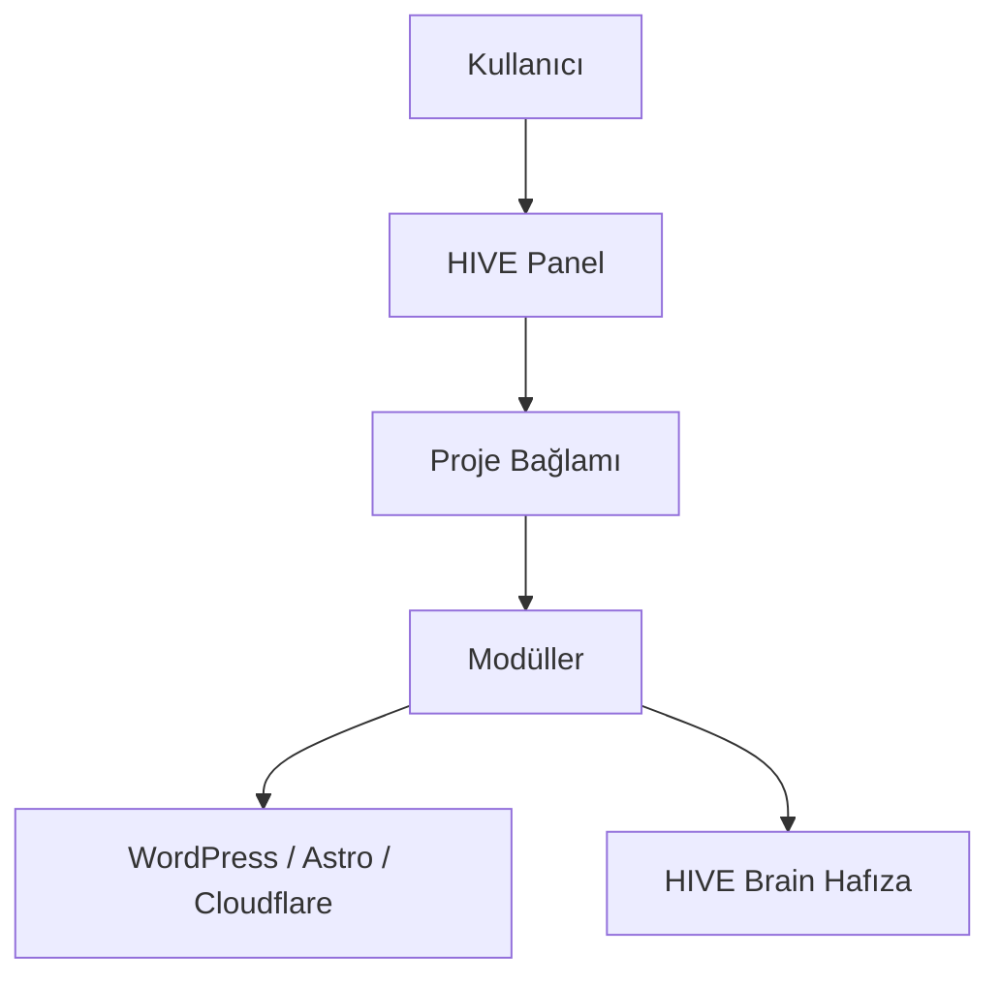

# HIVE Nedir?

## Bu bölümde ne öğreneceksiniz?

HIVE'in ne olduğunu, kimler için tasarlandığını ve panel + modül mimarisinin temel mantığını öğreneceksiniz.

## Kısa cevap

**HIVE**, birden fazla web sitesi ve SEO kampanyasını tek panelden yönetmenizi sağlayan modüler bir **SEO Operating System (SEO OS)** platformudur.

## Detaylı açıklama

HIVE; keyword araştırması (Talon), içerik üretimi (QIE, Astro Factory), yayın (Publisher Hub), otorite ağı (Authority Mesh), izleme (Rank Watcher) ve komuta (Mission Control) katmanlarını bir araya getirir.

Kodda **firma** entity'si yoktur; her müşteri veya site bağlamı bir **proje (project)** olarak tanımlanır. Aktif proje seçildiğinde modüller domain ve site URL bilgisini otomatik çözer.

HIVE Panel 3.0 şu adreslerde çalışır:
- **Canlı:** https://hive.thiqos.com
- **Geliştirme:** http://localhost:4000 (panel), http://localhost:4001 (API)

## HIVE içinde nerede kullanılır?

- Sol menü: **HIVE OS** grupları (COMMAND, SEO CORE, CONTENT, NETWORK…)
- Üst bar: **Projects** — aktif firma/site seçimi
- **Mission Control** — tüm modüllerin özet cockpit'i

## Adım adım kullanım

1. Panele giriş yapın.
2. İlk projenizi oluşturun (Projects → Yeni Proje).
3. Projeyi aktif yapın.
4. **First Run Wizard** veya **HIVE Academy** ile öğrenme yolunu takip edin.
5. Talon ile keyword araştırması başlatın.

## Örnek senaryo

Bir dijital ajans 8 müşteri sitesini yönetiyor. Her müşteri için HIVE'da ayrı proje açılır. SEO uzmanı sabah Mission Control'dan decay alarmlarına bakar, Content Refresh ile güncelleme planlar, Publisher Hub ile yayınlar.

## Görsel alanı

> 📷 Screenshot placeholder: Mission Control ana ekranı — alarm kartları, kampanya durumu ve provider sağlığı.

## Akış diyagramı

## En iyi kullanım

- Her operasyon öncesi doğru projeyi aktif seçin.
- Mission Control'u günlük kontrol noktası yapın.
- Modül çıktılarını HIVE Brain'de takip edin.

## Yapılmaması gerekenler

- Tek projeye tüm domainleri yığmayın.
- API key olmadan provider modüllerini canlıda zorlamayın.
- Black Ops modüllerini eğitim amacı dışında kullanmayın.

## Yaygın hatalar

**Modül yanlış domain kullanıyor** → Aktif proje kontrol edin.
**401 Unauthorized** → Oturum süresi dolmuş; yeniden giriş yapın.

## Sık sorulan sorular

**HIVE bir CMS mi?** Hayır; CMS'lerle (WordPress) entegre olur ama kendisi içerik yönetim sistemi değildir.

**Kaç modül var?** Kayıt defterinde 116+ panel modülü bulunur.

## İlgili konular

- [HIVE Ne Değildir?](hive-ne-degildir)
- [HIVE Mantığı](hive-mantigi)
- [Project Nedir?](project-nedir)

## Sonraki konu

Sonraki konu: **HIVE Ne Değildir?**
