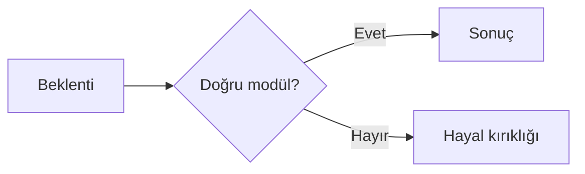

# HIVE Ne Değildir?

## Bu bölümde ne öğreneceksiniz?

HIVE'ın sınırlarını ve yanlış beklentileri netleştireceksiniz.

## Kısa cevap

HIVE bir CRM, muhasebe yazılımı, hosting paneli veya sıra garantisi veren sihirli bir araç **değildir**.

## Detaylı açıklama

| HIVE değildir | Gerçek |
|---------------|--------|
| CRM / ERP | Müşteri faturalama, sözleşme, muhasebe yok |
| Hosting paneli | cPanel alternatifi değil; deploy scriptleri sunar |
| Sıra garantisi | SEO araçları + otomasyon; sonuç garantisi yok |
| İlan sitesi motoru | Listing Hub ilan tutar; Place SEO otorite içeriği üretir |
| Tam otonom AI | Autonomous Agent önerir; insan onayı gerekebilir |

## HIVE içinde nerede kullanılır?

Bu sınırlar **Production Readiness**, **Quality Gate** ve **Executive AI** özetlerinde de vurgulanır.

## Adım adım kullanım

1. Yeni modül kullanmadan önce 'ne yapmaz' bölümünü okuyun.
2. Provider Control Center'dan API durumunu kontrol edin.
3. Beklentiyi modül ansiklopedisiyle eşleştirin.

## Örnek senaryo

Kullanıcı Rank Tracker'ın otomatik içerik yazacağını sanıyor. Rank Tracker yalnızca sıra izler; içerik için QIE veya SEO Content Agent gerekir.

## Görsel alanı

> 📷 Screenshot placeholder: Modül detay sayfasında 'Ne yapmaz' uyarı alanı.

## Akış diyagramı

## En iyi kullanım

Modülü kullanmadan önce Academy ansiklopedisinde 'Ne işe yaramaz' bölümünü okuyun.

## Yapılmaması gerekenler

HIVE'ı tek başına tüm dijital pazarlama stack'i sanmayın.

## Yaygın hatalar

Yanlış modül seçimi en yaygın hatadır — Campaign Engine planlar, içerik üretmez.

## Sık sorulan sorular

**WordPress yerine geçer mi?** Hayır; WP Manager ile WP'yi yönetirsiniz.

## İlgili konular

- [HIVE Nedir?](hive-nedir)
- [Quality Gate](quality-gate-nedir)

## Sonraki konu

Sonraki: **SEO, GEO ve AEO Nedir?**
