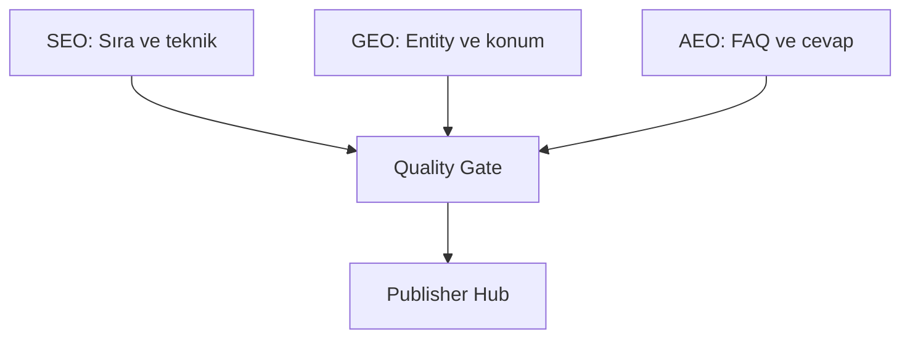

# SEO, GEO ve AEO Nedir?

## Bu bölümde ne öğreneceksiniz?

Üç kavramın farkını ve HIVE modüllerinde nasıl bir arada kullanıldığını öğreneceksiniz.

## Kısa cevap

**SEO** klasik arama optimizasyonu, **GEO** yapay zekâ ve yerel/konumsal görünürlük, **AEO** cevap motorları ve AI Overview uyumluluğudur.

## Detaylı açıklama

**SEO (Search Engine Optimization):** Teknik sağlık, keyword, backlink, içerik yapısı. HIVE: Talon, Crawl Gap, Rank Watcher.

**GEO (Generative Engine Optimization):** ChatGPT, Perplexity, Google AI Overview gibi sistemlerde görünürlük. HIVE: Entity GEO Graph, Citation Engine, Place SEO.

**AEO (Answer Engine Optimization):** Soru-cevap formatı, FAQ, PAA, snippet uyumu. HIVE: QIE, SSS Automation, Quality Gate AEO skoru.

## HIVE içinde nerede kullanılır?

- **SEO Quality Gate** — üç alanı birlikte skorlar
- **QIE** — AEO içerik üretimi
- **Entity GEO Graph** — GEO haritası

## Adım adım kullanım

1. Talon ile seed keyword seçin.
2. QIE ile FAQ üretin.
3. Quality Gate'den geçirin.
4. Publisher Hub ile yayınlayın.
5. Citation Engine ile AI görünürlüğü ölçün.

## Örnek senaryo

Kuşadası gece hayatı sitesi: SEO için pillar sayfalar, GEO için mekan entity'leri, AEO için 'Kuşadası'da gece nereye gidilir?' FAQ blokları.

## Görsel alanı

> 📷 Screenshot placeholder: Quality Gate diagnostik ekranı — SEO/GEO/AEO skorları.

## Akış diyagramı

## En iyi kullanım

Her içerik parçasını üç perspektiften kontrol edin.

## Yapılmaması gerekenler

Yalnızca keyword doldurup GEO/AEO alanlarını boş bırakmayın.

## Yaygın hatalar

FAQ'sız uzun makaleler AEO skorunu düşürür.

## Sık sorulan sorular

**GEO ile Local SEO aynı mı?** Yakın ama GEO daha geniş — AI ve generative arama dahil.

## İlgili konular

- [Quality Gate](quality-gate-nedir)
- [Entity SEO](entity-seo) — bölüm 03

## Sonraki konu

Sonraki: **HIVE Mantığı**
