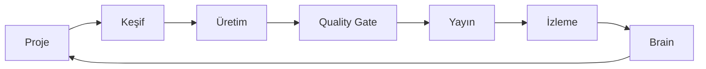

# HIVE Mantığı

## Bu bölümde ne öğreneceksiniz?

Proje merkezli çalışma, modül orkestrasyonu ve hafıza katmanını anlayacaksınız.

## Kısa cevap

HIVE **proje seç → modül çalıştır → kalite kontrol → yayın → izle → öğren** döngüsüyle çalışır.

## Detaylı açıklama

1. **Bağlam:** Aktif proje domain ve sektör bilgisini taşır.
2. **Keşif:** Talon, Opportunity, Crawl Gap veri üretir.
3. **Plan:** Campaign Engine, Executive AI önceliklendirir.
4. **Üretim:** QIE, Astro, StoryForge içerik oluşturur.
5. **Kalite:** SEO Quality Gate engelleyici olabilir.
6. **Yayın:** Publisher Hub, WP Manager, Cloudflare deploy.
7. **Hafıza:** HIVE Brain olayları saklar.
8. **Komuta:** Mission Control özeti sunar.

## HIVE içinde nerede kullanılır?

Mission Control, HIVE Brain, Action Orchestrator bu döngünün üst katmanıdır.

## Adım adım kullanım

1. Proje oluştur ve aktif yap.
2. First Run Wizard'ı tamamla.
3. Günlük Mission Control kontrolü.
4. Modül çıktılarını Brain'de incele.

## Örnek senaryo

Decay alarmı → Content Refresh → Quality Gate → Publish → Rank Watcher doğrulama.

## Görsel alanı

> 📷 Screenshot placeholder: HIVE Brain timeline görünümü.

## Akış diyagramı

## En iyi kullanım

Kısa döngülerle ilerleyin; büyük patlama yerine sürekli iyileştirme.

## Yapılmaması gerekenler

Quality Gate'i atlayarak toplu publish yapmayın.

## Yaygın hatalar

Aktif proje olmadan modül çalıştırmak yanlış domain'e işlem riski taşır.

## Sık sorulan sorular

**Modüller birbirini otomatik tetikler mi?** Bazı zincirler var (SSS Automation); çoğu manuel veya Action Orchestrator ile.

## İlgili konular

- [Active Project Context](active-project-context)
- [Mission Control](hive-nedir)

## Sonraki konu

Sonraki bölüm: **İlk Gün** — İlk Giriş
