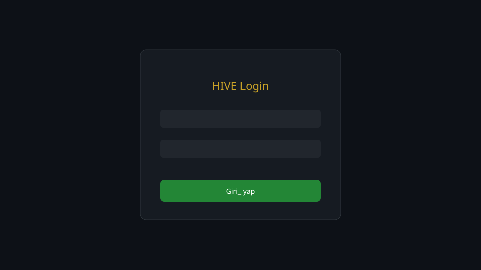
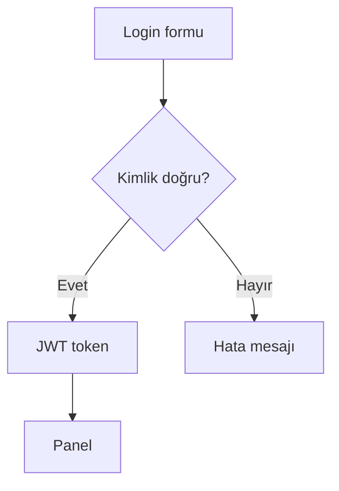

# İlk Giriş

## Bu bölümde ne öğreneceksiniz?

HIVE paneline nasıl giriş yapılacağını ve oturum güvenliğini öğreneceksiniz.

## Kısa cevap

https://hive.thiqos.com adresine gidin, admin e-posta ve şifrenizle **Login** ekranından giriş yapın.

## Detaylı açıklama

Kimlik doğrulama JWT tabanlıdır. Başarılı girişte tarayıcı token saklar ve API isteklerine `Authorization: Bearer` eklenir.

Geliştirme ortamında auth yapılandırılmamışsa API key modu devreye girebilir; production'da mutlaka `HIVE_ADMIN_EMAIL` ve `HIVE_ADMIN_PASSWORD_HASH` tanımlı olmalıdır.

## HIVE içinde nerede kullanılır?

Login sayfası: panel kökü `/` — oturum yoksa yönlendirilir.

## Adım adım kullanım

1. Tarayıcıda panel URL'sini açın.
2. E-posta ve şifreyi girin.
3. **Giriş** butonuna tıklayın.
4. Dashboard veya son kaldığınız sayfa açılır.
5. Sağ üstten kullanıcı menüsünden şifre değiştirin (ilk girişte önerilir).

## Örnek senaryo

Yeni SEO uzmanı ilk gün: admin hesabıyla giriş → Users & Roles'da kendi viewer/editor hesabı istenir → First Run Wizard başlatılır.

## Görsel alanı

## API

| Method | Endpoint | Açıklama |
|--------|----------|----------|
| POST | `/api/auth/login` | E-posta/şifre ile JWT token al |
| GET | `/api/auth/me` | Oturum, rol ve active_project_id |
| POST | `/api/auth/logout` | Oturumu sonlandır |
| GET | `/api/health` | Backend bağlantı kontrolü |

## Akış diyagramı

## En iyi kullanım

Güçlü şifre kullanın; paylaşımlı admin hesabından kaçının.

## Yapılmaması gerekenler

Şifreyi chat veya e-postada paylaşmayın.

## Yaygın hatalar

**401 Invalid** — yanlış şifre veya süresi dolmuş oturum.

## Sık sorulan sorular

**API key ile panel?** Otomasyon içindir; günlük kullanımda JWT tercih edin.

## İlgili konular

- [Paneli Tanıyalım](paneli-taniyalim)
- [Kullanıcı ve Roller](kullanici-ve-roller)

## Sonraki konu

Sonraki: **Paneli Tanıyalım**
