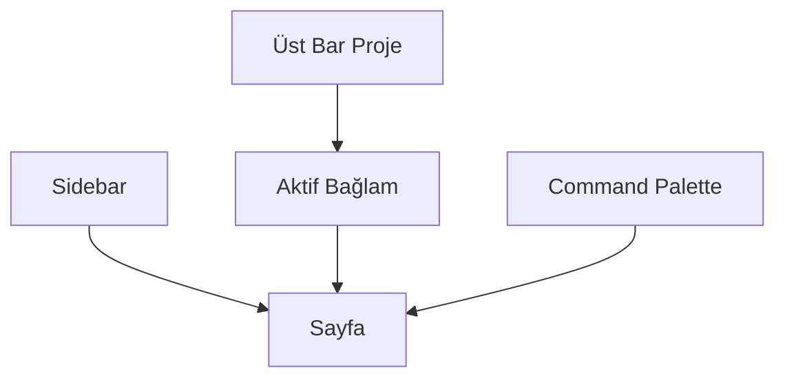

# Paneli Tanıyalım

## Bu bölümde ne öğreneceksiniz?

Sidebar, üst bar, command palette ve sayfa yapısını tanıyacaksınız.

## Kısa cevap

Sol tarafta **HIVE OS** menüsü, üstte **aktif proje seçici**, ortada modül sayfası, `Cmd+K` ile command palette bulunur.

## Detaylı açıklama

**Ana bölgeler:**
- **HiveOsSidebar:** COMMAND, SEO CORE, CONTENT, NETWORK, WORKERS, LEARN, TOOLS
- **Üst bar:** Proje seçici, kullanıcı, palette kısayolu
- **İçerik alanı:** Seçilen modülün React sayfası
- **Klasik modül listesi:** Tüm 116 modüle erişim (gruplu)

Deep link örneği: `/mission-control`, `/talon`, `/academy`

## HIVE içinde nerede kullanılır?

Navigasyon: `frontend/src/config/hiveOsNav.js` ve `hiveOsRoutes.js`

## Adım adım kullanım

1. Sidebar'da Mission Control'a tıklayın.
2. `Cmd+K` / `Ctrl+K` ile palette açın — 'Talon' arayın.
3. Projects menüsünden proje listesine gidin.
4. LEARN grubundan HIVE Academy'yi açın.

## Örnek senaryo

Operatör sabah palette'ten 'Rank Watcher' yazar, doğrudan modüle gider.

## Görsel alanı

> 📷 Screenshot placeholder: HIVE OS sidebar ve üst proje seçici.

## Akış diyagramı

## En iyi kullanım

Sık kullanılan modülleri palette'e alışkanlık yapın.

## Yapılmaması gerekenler

Proje seçmeden domain gerektiren modül çalıştırmayın.

## Yaygın hatalar

Sayfa boş — yetki yoksa RBAC menüyü gizler; admin'e başvurun.

## Sık sorulan sorular

**Eski modül listesi nerede?** Klasik gruplu sidebar hâlâ mevcuttur.

## İlgili konular

- [İlk Firma Nasıl Eklenir](ilk-firma-nasil-eklenir)
- [Active Project Context](active-project-context)

## Sonraki konu

Sonraki: **İlk Firma Nasıl Eklenir?**
