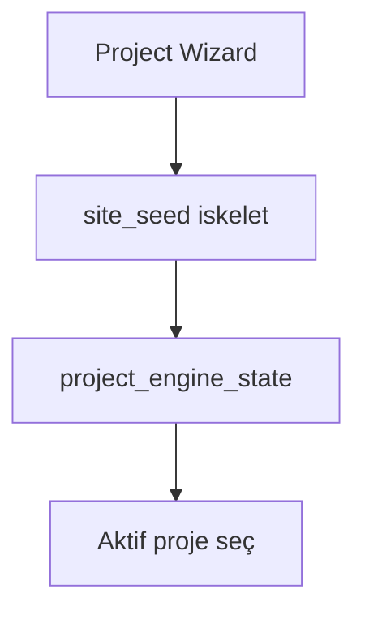

# İlk Firma Nasıl Eklenir?

## Bu bölümde ne öğreneceksiniz?

HIVE'da firma = proje mantığını ve ilk proje oluşturma adımlarını öğreneceksiniz.

## Kısa cevap

**Projects → Yeni Proje** ile ad, sektör ve kısa iş tanımı girerek firmanızı (projeyi) oluşturun.

## Detaylı açıklama

HIVE'da her müşteri veya marka bir **proje** kaydıdır. Proje oluşturulunca:
- `project_engine_state.json` güncellenir
- Sektör paketine göre sayfa iskeleti üretilir
- SEO/GEO skorları hesaplanır
- Durum `draft` olarak başlar

## HIVE içinde nerede kullanılır?

- Menü: **Projects** (`/projects`)
- Sihirbaz: `/projects/new`
- API: `POST /api/v3/projects`

## Adım adım kullanım

1. Projects → **Yeni Proje**.
2. **Proje adı:** örn. Balkutusu
3. **Sektör:** nightlife, restaurant vb. seçin
4. **Domain:** balkutusu.com (opsiyonel ama önerilir)
5. **Business brief:** 2-3 cümle iş tanımı
6. **Deploy mode:** hive_cloud (varsayılan)
7. Oluştur → detay sayfasında içeriği düzenleyin
8. Üst bardan **aktif proje** yapın

## Örnek senaryo

Operation Phoenix: `Phoenix Demo — Thiqos Turizm` projesi seed script ile oluşturulur, Projects listesinde görünür, **Aktif yap** ile seçilir — Talon ve diğer modüller domain'i otomatik alır.

## Görsel alanı

## API

| Method | Endpoint | Açıklama |
|--------|----------|----------|
| GET | `/api/v3/projects` | Proje listesi |
| POST | `/api/v3/projects` | Yeni proje oluştur |
| GET | `/api/v3/projects/{id}` | Proje detayı |
| POST | `/api/v3/projects/{id}/set-active` | Aktif proje seç |
| GET | `/api/v3/projects/active` | Aktif proje payload |

## Akış diyagramı

## En iyi kullanım

Anlamlı proje adı ve dolu business brief kullanın — LLM modülleri bunu okur.

## Yapılmaması gerekenler

Test projelerini production domain ile karıştırmayın.

## Yaygın hatalar

**sector gerekli** — sektör seçilmeden kayıt olmaz.

## Sık sorulan sorular

**Firma ve proje farkı?** Kodda fark yok; proje = firma bağlamı.

## İlgili konular

- [Project Nedir?](project-nedir)
- [İlk Domain Nasıl Eklenir](ilk-domain-nasil-eklenir)

## Sonraki konu

Sonraki: **İlk Domain Nasıl Eklenir?**
