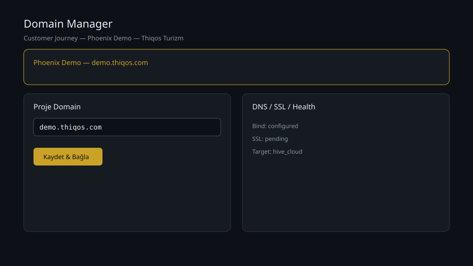
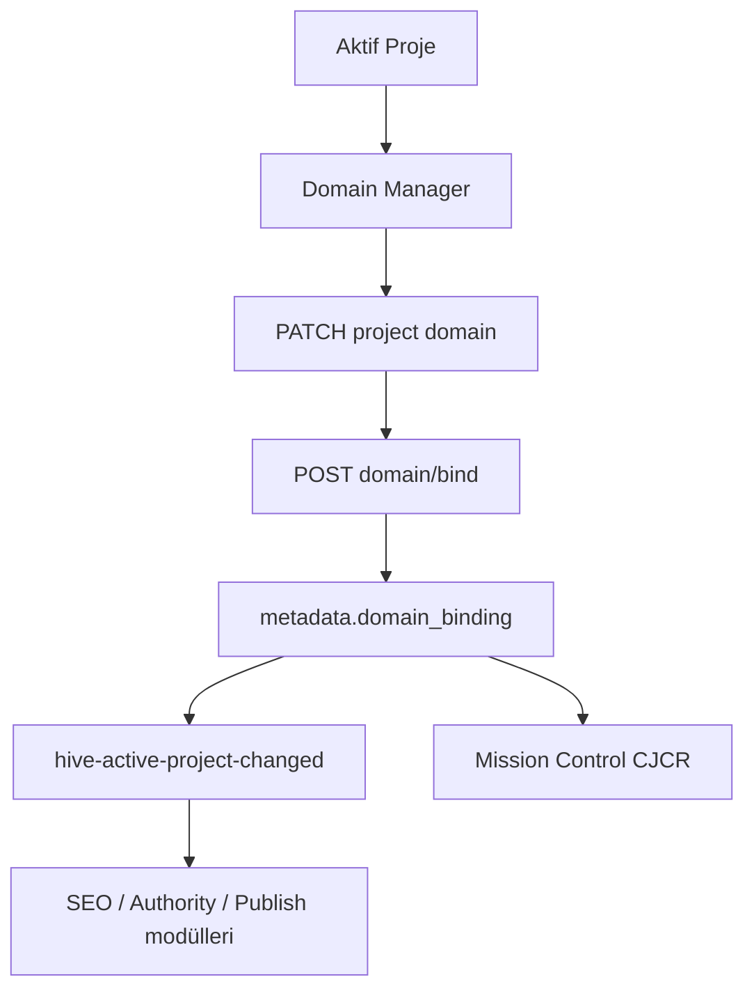

# İlk Domain Nasıl Eklenir?

## Bu bölümde ne öğreneceksiniz?

Domain nedir, HIVE'da neden kritiktir, demo projede nasıl görünür, Domain Manager ile nasıl eklenir/doğrulanır ve DNS/SSL/Health alanlarının anlamını öğreneceksiniz.

## Domain nedir?

**Domain**, sitenizin internetteki adresidir (ör. `demo.thiqos.com`). Ziyaretçiler bu adrese gider; arama motorları ve HIVE modülleri aynı adresi hedef alır.

## HIVE içinde domain neden önemlidir?

Customer Journey'de **Adım 3 — Domain**, tüm sonraki adımların (SEO, Authority, Publish, Deploy) ortak bağlamıdır:

- Aktif proje kaydındaki `domain` alanı modüllere yayılır.
- `domain_binding` metadata'sı nginx/SSL hedefini tanımlar.
- `ActiveProjectContext` ve `hive-active-project-changed` event'i formları senkron tutar.

Domain olmadan Talon, Rank Watcher ve Publisher Hub yanlış veya boş site adresi kullanır.

## Kısa cevap

**Domain Manager** (`/domain-manager`) → aktif projede domain girin → **Kaydet & Bağla** → **Domain Doğrula** ile DNS/SSL/Health kontrol edin.

## Demo projede domain nasıl görünür?

Operation Phoenix demo projesi:

| Alan | Değer |
|------|-------|
| Proje | Phoenix Demo — Thiqos Turizm |
| ID | `prj-161789b6ec` |
| Domain | `demo.thiqos.com` |

Aktif proje seçildiğinde Domain Manager üstünde **Phoenix Demo** banner'ı görünür; sağ panelde bind durumu ve SSL satırları dolar.

## Domain nasıl eklenir?

1. Üst bardan **Phoenix Demo — Thiqos Turizm** projesini aktif yapın (Projects).
2. Menüden **Domain Manager** açın.
3. **Üretim domain** alanına `demo.thiqos.com` yazın (http/https olmadan).
4. İsterseniz **www dahil et** kutusunu işaretleyin.
5. **Kaydet & Bağla** — proje PATCH + domain bind API çağrılır.
6. Toast: `Domain kaydedildi: demo.thiqos.com`

## Domain nasıl doğrulanır?

1. **Domain Doğrula** butonuna tıklayın.
2. Sağ panel **DNS / SSL / Health** alanlarını yeniler.
3. Bind metadata: `status: configured`, `ssl_status: pending` (yerel demo) veya `active` (üretim SSL sonrası).

Kayıt firmasında A/CNAME kaydını sunucuya yönlendirin; yayılım 5–48 saat sürebilir.

## DNS / SSL / Health ne anlama gelir?

| Alan | Anlam |
|------|-------|
| **DNS** | Domain'in IP veya proxy'ye çözümlenmesi (A/CNAME) |
| **Bind durumu** | HIVE'ın domain'i projeye bağlaması (`configured` = kayıtlı) |
| **SSL** | HTTPS sertifikası (`pending` / `active`) |
| **Health** | Canlı site erişilebilirliği ve nginx hedefi |
| **Target** | `hive_cloud` veya üretim web root |

## HIVE içinde nerede kullanılır?

- **UI:** Domain Manager (`DomainManager.js`)
- **Context:** `project_context.py`, `ActiveProjectContext.js`
- **Backend:** `project_engine.bind_project_domain`, `hive_production_deploy`

## Adım adım kullanım

1. Aktif proje seç.
2. Domain Manager → domain gir.
3. Kaydet & Bağla.
4. Domain Doğrula.
5. Mission Control → Customer Journey kartında **Domain** adımı `completed` olur (CJCR 37.5%).

## Örnek senaryo

Phoenix demo: seed script `demo.thiqos.com` yazar; kullanıcı Domain Manager'da domain'i görür, gerekirse günceller ve doğrular. Talon açıldığında site URL otomatik `https://demo.thiqos.com` bağlamını kullanır.

## Görsel alanı

## API

| Method | Endpoint | Açıklama |
|--------|----------|----------|
| PATCH | `/api/v3/projects/{id}` | Proje `domain` alanını güncelle |
| POST | `/api/v3/projects/{id}/domain/bind` | Domain bind (`include_www`) |
| GET | `/api/v3/projects/{id}/domain/status` | DNS/SSL/bind durumu |
| GET | `/api/v3/projects/active` | Aktif proje + domain |
| GET | `/api/phoenix/customer-journey` | CJCR ve Domain adım durumu |

## Akış diyagramı

## En iyi kullanım

- www ve apex tutarlılığı için bind'de `include_www: true` kullanın.
- Domain değişince Mission Control'da Domain adımını yeniden doğrulayın.

## Yapılmaması gerekenler

DNS yayılımını beklemeden "canlı" sanmayın; SSL `pending` iken HTTPS zorlamayın.

## Yaygın hatalar

| Hata | Çözüm |
|------|-------|
| Aktif proje yok | Projects → demo projeyi aktif yap |
| Geçersiz domain formatı | `https://` yazmayın; sadece `demo.thiqos.com` |
| Modül yanlış site | Üst barda doğru proje seçili mi kontrol edin |
| Bind boş | Kaydet & Bağla sonrası Domain Doğrula |

## Troubleshooting

- **404 domain/status:** Proje ID ve oturum geçerli mi?
- **Bind failed:** Domain formatı ve aktif proje ID'sini kontrol edin.
- **CJCR güncellenmedi:** `python3 scripts/phoenix-customer-journey-audit.py` çalıştırın.

## Sık sorulan sorular

**Alt domain?** Subdomain Manager ile ayrı yönetilir.  
**WordPress multisite?** Eski WP domain CRUD `domain_manager.py` altında; proje domain'i Domain Manager UI'dan yönetilir.

## İlgili konular

- [Active Project Context](../02-firma-proje-yonetimi/002-active-project-context.md)
- [Mission Control Dashboard](../demo-flow/001-mission-control-dashboard.md)
- [Customer Journey — Domain Adımı](../demo-flow/002-customer-journey-domain.md)

## Sonraki konu

Sonraki Customer Journey adımı: **SEO** (Talon, Entity Graph, Quality Gate).

## Changelog

- **2.0.0** (2026-06-26): Operation Phoenix Step 3 — Domain Manager UI, bind API, CJCR data checks, demo banner.
- **1.0.0**: İlk taslak.

<!-- AI_UPDATE_SLOT -->
