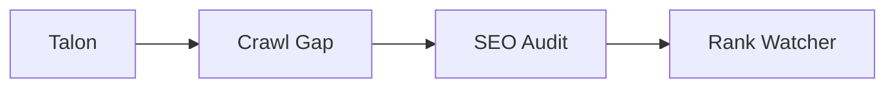

# İlk SEO Analizi

## Bu bölümde ne öğreneceksiniz?

İlk gün yapılacak minimum SEO analiz paketini öğreneceksiniz.

## Kısa cevap

Sıra: **Talon** keyword → **Crawl Gap** veya **SEO Audit** → **Rank Watcher** kurulumu.

## Detaylı açıklama

İlk gün hedefi mükemmel strateji değil, **baseline** oluşturmaktır:
- Hangi keyword'lere odaklanılacak?
- Sitede hangi sayfalar var / eksik?
- Teknik sorun var mı?
- Mevcut sıralama nedir?

## HIVE içinde nerede kullanılır?

- Talon: `/talon`
- Crawl Gap: `/crawl-gap`
- SEO Audit: klasik modül
- Rank Watcher: `/rank-watcher`

## Adım adım kullanım

1. Aktif projeyi seç.
2. Talon'da seed keyword gir → Full Research.
3. Crawl Gap ile site URL tara.
4. SEO Audit çalıştır.
5. Rank Watcher'a 5-10 keyword ekle.

## Örnek senaryo

Yeni site: Talon 'kuşadası escort' yerine 'kuşadası gece hayatı' önerdi; crawl 12 sayfa, 8 gap buldu.

## Görsel alanı

> 📷 Screenshot placeholder: Talon Full Research sonuç ekranı.

## Akış diyagramı

## En iyi kullanım

İlk analizi Brain'e not düşecek şekilde modülleri sırayla çalıştırın.

## Yapılmaması gerekenler

Tek modül çıktısıyla tüm stratejiyi kilitlemeyin.

## Yaygın hatalar

Provider key eksik — API Settings'ten Tavily/SearXNG yapılandırın.

## Sık sorulan sorular

**DataForSEO şart mı?** Hayır; ücretsiz provider'lar Talon V2'de mevcut.

## İlgili konular

- [SEO Mantığı](seo-mantigi)
- [Campaign Engine](hive-mantigi)

## Sonraki konu

Sonraki: **İlk Publish**
