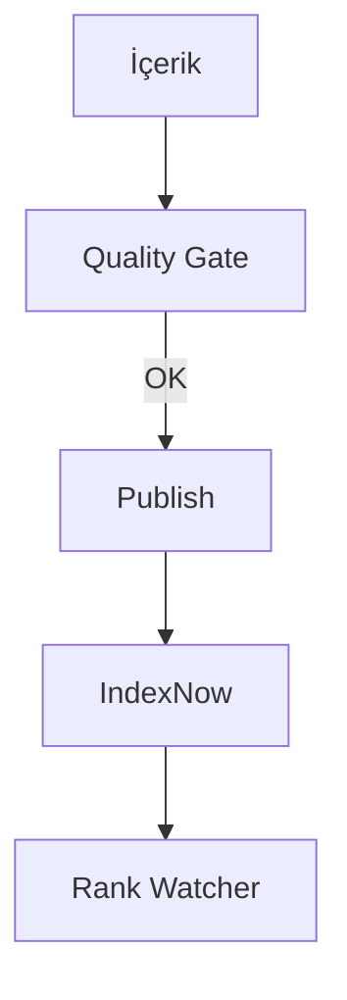

# İlk Publish

## Bu bölümde ne öğreneceksiniz?

İlk içeriği veya siteyi canlıya alma adımlarını öğreneceksiniz.

## Kısa cevap

İçerik üret → **Quality Gate** → **Publisher Hub** veya proje **Publish pipeline** → **IndexNow**.

## Detaylı açıklama

İki yayın yolu:
**A) V3 Astro proje:** export → build → publish → bind-domain
**B) WordPress içerik:** SEO Content Agent / QIE → Publisher Hub → WP REST

Her iki yolda da Quality Gate fail ise Auto Publisher deploy engeller.

## HIVE içinde nerede kullanılır?

- Proje detay: Publish butonları
- Publisher Hub: `/publisher-hub`
- Astro Auto Publisher: `/astro-auto-publisher`

## Adım adım kullanım

1. En az bir sayfa/içerik hazırla.
2. Diagnostics (Quality Gate) çalıştır.
3. Publisher Hub kuyruğuna ekle veya proje Publish.
4. IndexNow bildir.
5. Rank Watcher'da indeks/sıra izle.

## Örnek senaryo

İlk FAQ sayfası QIE'den üretildi, gate geçti, WP'ye yayınlandı, IndexNow 202 döndü.

## Görsel alanı

> 📷 Screenshot placeholder: Publisher Hub kuyruk ekranı.

## Akış diyagramı

## En iyi kullanım

İlk publish küçük olsun — tek sayfa doğrulama.

## Yapılmaması gerekenler

Gate uyarılarını yok saymayın.

## Yaygın hatalar

Build fail — Astro loglarını proje detaydan inceleyin.

## Sık sorulan sorular

**Cloudflare mi WP mi?** deploy_mode ve içerik tipine göre değişir.

## İlgili konular

- [Publish Pipeline](publish-pipeline-nedir)
- [Publisher Hub](publisher-hub-nedir)

## Sonraki konu

Bölüm 02: **Project Nedir?**
