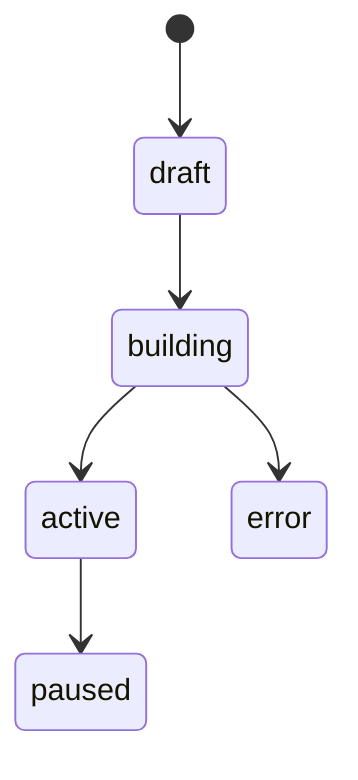

# Project Nedir?

## Bu bölümde ne öğreneceksiniz?

V3 proje modelinin alanlarını, durumlarını ve yaşam döngüsünü öğreneceksiniz.

## Kısa cevap

**Project**, HIVE'da bir site/kampanya bağlamını taşıyan kalıcı kayıttır — domain, sektör, sayfalar, skorlar ve deploy modu içerir.

## Detaylı açıklama

**Durumlar:** draft, building, active, paused, error

**Temel alanlar:** id, name, sector, domain, business_brief, design, pages, theme, navigation, deploy_mode, seo_score, geo_score

**Motor:** `project_engine.py` — state: `project_engine_state.json`

## HIVE içinde nerede kullanılır?

Projects UI, `/api/v3/projects/*`

## Adım adım kullanım

1. Liste: GET /api/v3/projects
2. Detay: GET /api/v3/projects/{id}
3. Güncelle: PATCH
4. Sil: DELETE (dikkatli)

## Örnek senaryo

8 aktif proje; her birinin farklı sector pack'i ve Astro export'u var.

## Görsel alanı

> 📷 Screenshot placeholder: Projects listesi kart görünümü.

## Akış diyagramı

## En iyi kullanım

Proje metadata'sını güncel tutun — Executive AI bunu okur.

## Yapılmaması gerekenler

Production projeyi test build ile silmeyin.

## Yaygın hatalar

not_found — yanlış project id veya yetki.

## Sık sorulan sorular

**Legacy /api/projects?** Eski API; V3 tercih edin.

## İlgili konular

- [Active Project Context](active-project-context)
- [İlk Firma Nasıl Eklenir](ilk-firma-nasil-eklenir)

## Sonraki konu

Sonraki: **Active Project Context**
