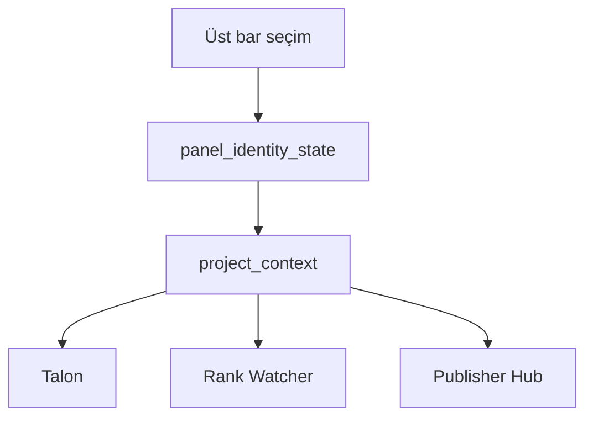

# Active Project Context Nedir?

## Bu bölümde ne öğreneceksiniz?

Aktif proje mekanizmasının modüllere domain nasıl ilettiğini öğreneceksiniz.

## Kısa cevap

Üst barda seçilen proje **active_project_id** olarak saklanır; modüller `project_context.resolve_domain()` ile domain alır.

## Detaylı açıklama

**Kaynak:** `panel_identity_state.json` → `active_project_id`

**Kod:** `project_context.py` — get/set active, resolve_domain, resolve_site_url

**Frontend:** `ActiveProjectContext.js`, `useProjectSiteField.js`

Proje değişince `hive-active-project-changed` event'i tetiklenir.

## HIVE içinde nerede kullanılır?

Üst bar proje dropdown; POST `/api/v3/projects/{id}/set-active`

## Adım adım kullanım

1. Proje listesinden seç.
2. Sayfayı yenilemeden modül formları güncellenir.
3. `/api/auth/me` active_project_id döner.

## Örnek senaryo

Phoenix demo aktifken üst barda **Phoenix Demo — Thiqos Turizm** görünür; domain `demo.thiqos.com` tüm SEO modüllerine yayılır.

## Görsel alanı

## API

| Method | Endpoint | Açıklama |
|--------|----------|----------|
| GET | `/api/v3/projects/active` | Aktif proje + project payload |
| POST | `/api/v3/projects/{id}/set-active` | Aktif proje ata |
| GET | `/api/auth/me` | active_project_id döner |

## Akış diyagramı

## En iyi kullanım

Modül çalıştırmadan önce üst barda doğru proje adını doğrulayın.

## Yapılmaması gerekenler

Her modülde manuel domain yazıp aktif projeyi bypass etmeyin.

## Yaygın hatalar

Boş domain — projede domain alanı doldurulmamış.

## Sık sorulan sorular

**Çoklu sekme?** Her sekme aynı active_project_id paylaşır (local state).

## İlgili konular

- [Domain Yönetimi](domain-yonetimi)
- [Project Nedir?](project-nedir)

## Sonraki konu

Bölüm 03: **Quality Gate**
