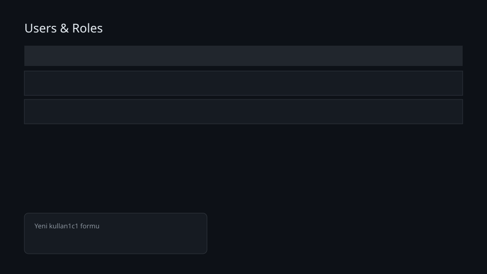
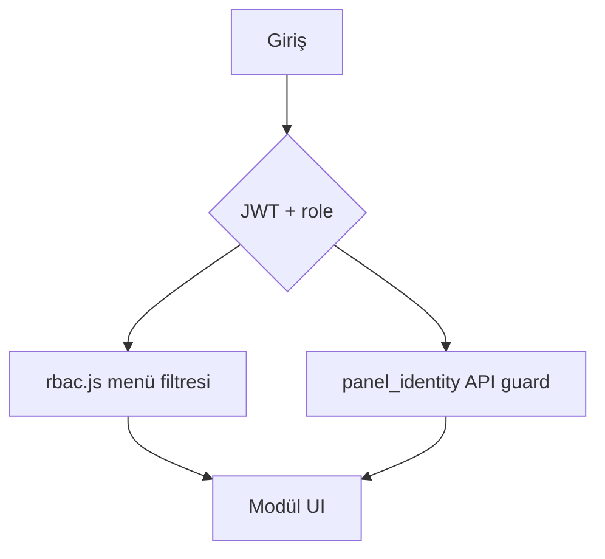

# Users & Permissions

## Bu bölümde ne öğreneceksiniz?

HIVE'de kullanıcı rolleri, modül izinleri (RBAC) ve ekip yönetimini öğreneceksiniz.

## Kısa cevap

**Users & Roles** ekranından ekip üyeleri eklenir; her kullanıcıya `super_admin`, `admin`, `seo_manager`, `editor` veya `viewer` rolü atanır. İzinler `panel_identity.py` üzerinden API ve menüye yansır.

## Detaylı açıklama

HIVE çok kullanıcılı panel mimarisine sahiptir. Roller:

| Rol | Yetki özeti |
|-----|-------------|
| `super_admin` | Tüm modüller ve kullanıcı yönetimi |
| `admin` | Campaign, Authority, Publisher, Projects |
| `seo_manager` | Mission Control, Citation, Rank Watcher |
| `editor` | Publisher, içerik modülleri |
| `viewer` | Salt okunur — Mission Control |

Frontend menü filtresi: `frontend/src/rbac.js` — `canViewNav(role, navId)`  
Backend kontrol: `panel_identity.has_permission(role, module, action)`

## HIVE içinde nerede kullanılır?

COMMAND → **Users & Roles** (`/users`)

## Adım adım kullanım

1. Admin olarak giriş yapın.
2. Users & Roles ekranını açın.
3. E-posta, isim, rol ve geçici şifre girin → **Kullanıcı Ekle**.
4. Yeni kullanıcı ile çıkış yapıp giriş test edin.
5. Viewer rolünde menüde yalnızca izinli modüller görünür.

## Örnek senaryo

Operation Phoenix Customer Journey — Adım 1: Yeni kullanıcı panelde giriş yapar. Ajans demosu: `seo_manager@firma.com` oluşturulur → Mission Control ve Talon görünür → Users ekranı görünmez (yetki yok).

## Görsel alanı

## API

| Method | Endpoint | Açıklama |
|--------|----------|----------|
| GET | `/api/users` | Kullanıcı listesi (admin) |
| POST | `/api/users` | Yeni kullanıcı |
| GET | `/api/auth/me` | Oturum + role + active_project_id |

## En iyi kullanım

- Müşteri demolarında `viewer` veya `seo_manager` hesabı kullanın.
- Üretimde `super_admin` sayısını minimum tutun.

## Yapılmaması gerekenler

- Tüm ekibe `super_admin` vermeyin.
- Paylaşılan tek şifre kullanmayın.

## Yaygın hatalar / Troubleshooting

| Sorun | Çözüm |
|-------|--------|
| Menü boş | Rol `viewer` — admin'den yetki isteyin |
| 403 API | `has_permission` — rol modülü kapsamıyor |
| Kullanıcı eklenemiyor | E-posta çakışması veya admin değilsiniz |

## Sık sorulan sorular

**Proje bazlı yetki var mı?** Şu an rol global; proje erişimi aktif proje bağlamıyla yönetilir.

## İlgili konular

- [Active Project Context](active-project-context)
- [Project Nedir?](project-nedir)
- [İlk Giriş](../01-ilk-gun/001-ilk-giris)

## Sonraki konu

GROUP B: **Talon (Keyword)** ve **Quality Gate**

<!-- AI_UPDATE_SLOT -->
