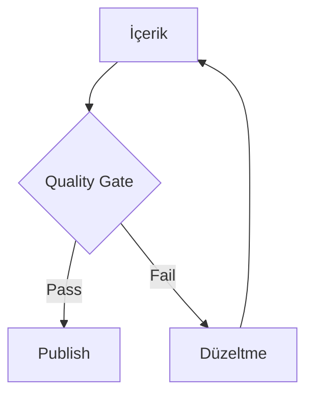

# Quality Gate Nedir?

## Bu bölümde ne öğreneceksiniz?

SEO/GEO/AEO kalite kapısının nasıl çalıştığını ve publish engelini öğreneceksiniz.

## Kısa cevap

**Quality Gate**, içeriğin SEO, GEO, AEO ve entity standartlarına uygunluğunu skorlar; fail durumda Astro Auto Publisher deploy'u **engeller**.

## Detaylı açıklama

Modül: `seo_quality_gate.py`

Kontroller: başlık yapısı, FAQ varlığı, entity coverage, AI Overview uyumu, spam sinyalleri.

Route: `/diagnostics` — HIVE OS TOOLS altında **Diagnostics**

## HIVE içinde nerede kullanılır?

Publisher Hub ve Astro Auto Publisher bu gate çıktısını okur.

## Adım adım kullanım

1. İçerik üret.
2. Diagnostics'te çalıştır.
3. Fail maddeleri düzelt.
4. Tekrar test.
5. Publish.

## Örnek senaryo

FAQ eksik makale gate'de kaldı; QIE ile 5 soru eklendi, geçti.

## Görsel alanı

> 📷 Screenshot placeholder: Quality Gate skor kartları.

## Akış diyagramı

## En iyi kullanım

Gate'i publish öncesi zorunlu checklist yapın.

## Yapılmaması gerekenler

Skoru manuel bypass etmeye çalışmayın.

## Yaygın hatalar

Sürekli fail — business_brief ve sector pack uyumsuz olabilir.

## Sık sorulan sorular

**Sadece Astro mu?** WP içerikleri için de kullanılır.

## Örnek senaryo

Bir Astro projesinin SEO/GEO/AEO hazır olup olmadığını kontrol etmek.

1. Quality Gate sayfasını açın — SEO, GEO ve AEO skor kartlarını görün
2. **Readiness Report** sekmesinde eksik alanları inceleyin
3. **Fix Suggestions** ile otomatik düzeltme önerilerini alın
4. Her öneriyi uyguladıktan sonra "Analyze" butonuyla skoru yenileyin
5. Skor 70% üzerine çıkana kadar adımları tekrarlayın
6. **Export** ile readiness raporunu PDF/JSON olarak dışa aktarın

Beklenen sonuç: SEO 78%, GEO 52%, AEO 34% başlangıç skorları — fix önerileri uygulandıktan sonra tüm skorlar 70%+.

## İlgili konular

- [SEO GEO AEO](seo-geo-aeo-nedir)
- [Publisher Hub](publisher-hub-nedir)

## Sonraki konu

Bölüm 04: **Authority Factory**
