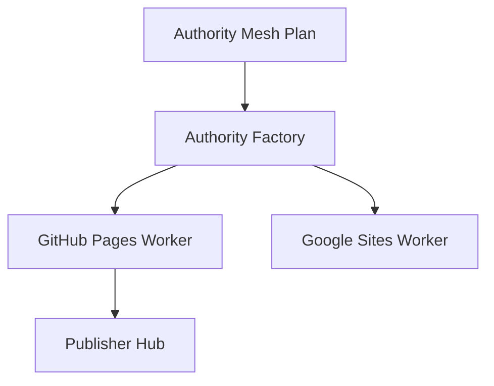

# Authority Factory Nedir?

## Genel Bakış

Authority Factory, Authority Mesh Engine tarafından üretilen planları kontrollü batch'lere dönüştüren üretim modülüdür. Her batch birden fazla authority site item'ı içerir ve bu item'lar sırayla işlenerek yayına hazır hale getirilir.

## Özellikler

- **V2 Batch Sistemi**: Campaign, Dataset veya Domain Intelligence kaynaklarından batch oluşturma
- **Provider Mix**: Her batch için otomatik provider dağılımı (Google Sites, GitHub Pages, Blogger, Tumblr, Dev.to, WordPress)
- **Auto Process**: Batch oluşturulduktan sonra otomatik işleme
- **Duplicate Block**: Aynı keyword için tekrar batch oluşturmayı engelleme
- **Preview Content**: Item bazında içerik önizleme
- **Export Reports**: Batch, item ve provider bazında rapor dışa aktarma

## Kullanım

1. **Dashboard**: Genel durum, batch sayıları ve son batch'ler
2. **Create From Campaign**: Campaign Engine'den batch oluşturma
3. **Create From Dataset**: Data Miner dataset'inden batch oluşturma
4. **Domain Candidates**: Domain Intelligence adaylarından batch oluşturma
5. **Provider Mix**: Varsayılan provider dağılımını görüntüleme
6. **Create Batch**: Manuel keyword ile batch oluşturma
7. **Batches**: Tüm batch'leri listeleme ve işleme
8. **Items**: Item bazında durum ve preview
9. **Processing / Published / Failed / Login Required**: Filtrelenmiş item listeleri
10. **Provider Status**: Provider hazır olma durumu
11. **Reports**: Rapor export
12. **Settings**: Güvenlik ve üretim ayarları

## API Entegrasyonu

Modül aşağıdaki API endpoint'lerini kullanır:

- `GET /api/authority-factory/health` — Sağlık kontrolü
- `GET /api/authority-factory/dashboard` — Dashboard verileri
- `GET /api/authority-factory/settings` — Ayarlar
- `POST /api/authority-factory/settings` — Ayarları kaydet
- `GET /api/authority-factory/batches` — Batch listesi
- `POST /api/authority-factory/create-batch` — Yeni batch oluştur
- `POST /api/authority-factory/process-batch/{id}` — Batch işle
- `POST /api/authority-factory/pause-batch/{id}` — Batch duraklat
- `POST /api/authority-factory/resume-batch/{id}` — Batch devam ettir
- `POST /api/authority-factory/create-from-campaign` — Campaign'den batch
- `POST /api/authority-factory/create-from-dataset` — Dataset'ten batch
- `POST /api/authority-factory/create-from-domain-candidates` — Domain adaylarından batch
- `GET /api/authority-factory/items` — Item listesi
- `GET /api/authority-factory/datasets` — Dataset listesi
- `GET /api/authority-factory/domain-candidates` — Domain adayları
- `GET /api/authority-factory/provider-mix` — Provider dağılımı
- `POST /api/authority-factory/preview-content` — İçerik önizleme
- `POST /api/authority-factory/export-report` — Rapor export

## Troubleshooting

- **Factory kapalı**: Settings sekmesinden `enabled=true` yapın
- **Provider missing**: Provider Status sekmesinden provider'ların hazır olduğunu kontrol edin
- **Batch işlenmiyor**: Auto Process kapalı olabilir, manuel "İşle" butonunu kullanın
- **Duplicate uyarısı**: Aynı keyword için daha önce batch oluşturulmuş olabilir

## Örnek Senaryo

"Kuşadası gece hayatı" keyword'ü için yeni bir authority batch'i oluşturma:

1. Create Batch sekmesine gidin
2. Keyword alanına "kuşadası gece hayatı" yazın
3. Money Site alanına hedef site URL'sini girin
4. Kaynak olarak "manual" seçin
5. Auto Process işaretleyin
6. Batch Oluştur butonuna tıklayın
7. Batch otomatik işlenmeye başlar
8. Batches sekmesinden durumu takip edin
9. Items / Published sekmesinden yayınlanan item'ları görüntüleyin

## Akış diyagramı

## En iyi kullanım

Küçük batch ile worker credentials doğrula.

## Yapılmaması gerekenler

API quota olmadan yüzlerce site açmayın.

## Sık sorulan sorular

**Mesh'ten farkı?** Mesh planlar; Factory üretir.

## İlgili konular

- [Citation Engine Nedir?](citation-engine-nedir)
- [Authority Mesh Engine Nedir?](authority-mesh-engine-nedir)
- [Publisher Hub Nedir?](publisher-hub-nedir)
