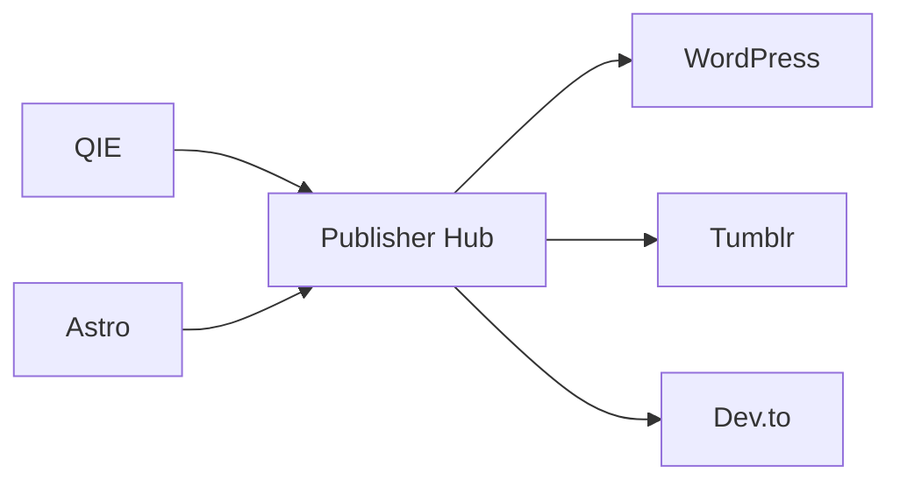

# Publisher Hub Nedir?

## Bu bölümde ne öğreneceksiniz?

Çok kanallı merkezi yayın kuyruğunu öğreneceksiniz.

## Kısa cevap

**Publisher Hub**, WordPress, Ghost, Dev.to, Tumblr, Medium ve daha fazlasına tek kuyruktan yayın yönetir.

## Detaylı açıklama

Modül: `publisher_hub.py` — state: `publisher_hub_state.json`

Quality Gate entegrasyonu vardır. Başarısız içerik kuyruğa alınmayabilir.

Route: `/publisher-hub`

## HIVE içinde nerede kullanılır?

CONTENT grubu; içerik modüllerinin çıkış noktası.

## Adım adım kullanım

1. İçerik kaynağı seç (QIE, Astro, manuel).
2. Hedef kanal ekle.
3. Kuyruğu gözden geçir.
4. Publish / schedule.
5. Brain'de olayı kontrol et.

## Örnek senaryo

Tek makale WP + Tumblr + Dev.to'ya sırayla gitti; Rank Watcher 48 saat sonra sıra değişimi gördü.

## Görsel alanı

> 📷 Screenshot placeholder: Publisher Hub kanal listesi ve kuyruk.

## Akış diyagramı

## En iyi kullanım

Kanal başına rate limit ve API key doğrula.

## Yapılmaması gerekenler

Aynı içeriği spam hızında tüm kanallara basmayın.

## Yaygın hatalar

WP 401 — wordpress_api bağlantısı kopuk.

## Sık sorulan sorular

**Ghost destekleniyor mu?** Evet; API key gerekir.

## İlgili konular

- [İlk Publish](ilk-publish)
- [Quality Gate](quality-gate-nedir)

## Sonraki konu

Modül ansiklopedisine geçin veya Publish Pipeline bölümünü okuyun.

## Örnek Senaryo

"Kuşadası gece hayatı" keyword'ü için bir authority sitesinin yayınlanması:

1. Dashboard sekmesinden genel durumu kontrol edin
2. Channels sekmesinden aktif kanalları görüntüleyin
3. Queue sekmesinden sıradaki yayınları inceleyin
4. Publish sekmesinden yeni yayın başlatın
5. Published sekmesinden yayınlanan içerikleri takip edin
6. Settings sekmesinden kanal yapılandırmasını yapın
