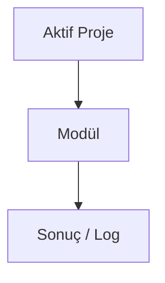

# AI Chat (Llama 3.1)

## Bu bölümde ne öğreneceksiniz?

**AI Chat (Llama 3.1)** modülünün HIVE içindeki rolünü özet düzeyde öğreneceksiniz.

## Kısa cevap

Cloudflare Workers AI ile sohbet (LLaMA 3.1 8B)

## Detaylı açıklama

**Modül ID:** `ai_chat`

**Grup:** 🤖 Yapay Zeka

**API endpoint:** `/api/ai_chat'`

<!-- AI_UPDATE_SLOT: module_ai_chat_detail -->

## HIVE içinde nerede kullanılır?

Panel: `/api/ai_chat` veya klasik modül listesinden **AI Chat (Llama 3.1)**.

## Adım adım kullanım

1. Aktif projeyi seçin.
2. Modül sayfasını açın.
3. Gerekli alanları doldurun.
4. Çalıştır ve sonucu Brain'de kontrol edin.

<!-- TODO: modüle özel adımlar -->

## Örnek senaryo

<!-- TODO: örnek senaryo -->

## Görsel alanı

> 📷 Screenshot placeholder: AI Chat (Llama 3.1) modül ekranı.

## Akış diyagramı

## En iyi kullanım

<!-- TODO: en iyi kullanım -->

## Yapılmaması gerekenler

<!-- TODO: yapılmaması gerekenler -->

## Yaygın hatalar

<!-- TODO: yaygın hatalar -->

## Sık sorulan sorular

**Bu modül içerik üretir mi?** Ansiklopedi taslağı — detay için Mission Control ve modül health endpoint'ini kontrol edin.

<!-- EKSİK_BİLGİ: ai_chat derin dokümantasyon -->

## İlgili konular

- Grup: 🤖 Yapay Zeka
- [Modül Ansiklopedisi README](../06-modul-ansiklopedisi/README.md)

## Sonraki konu

İlgili modül gruplarına göre Campaign Engine veya Mission Control'a bakın.
