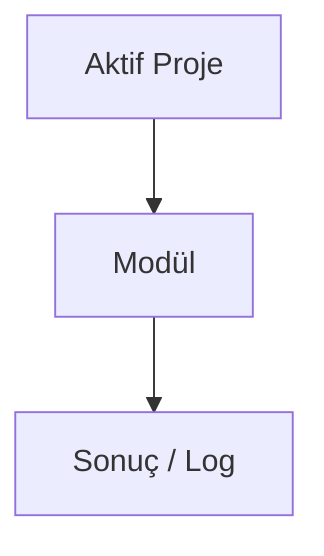

# Autonomous SEO Agent

## Bu bölümde ne öğreneceksiniz?

**Autonomous SEO Agent** modülünün HIVE içindeki rolünü özet düzeyde öğreneceksiniz.

## Kısa cevap

Merkezi SEO karar katmanı — modül çıktılarını okuyup aksiyon önerir

## Detaylı açıklama

**Modül ID:** `autonomous_seo_agent`

**Grup:** 📝 İçerik & SEO

**API endpoint:** `/api/autonomous-agent/health'`

<!-- AI_UPDATE_SLOT: module_autonomous_seo_agent_detail -->

## HIVE içinde nerede kullanılır?

Panel: `/api/autonomous-agent/health` veya klasik modül listesinden **Autonomous SEO Agent**.

## Adım adım kullanım

1. Aktif projeyi seçin.
2. Modül sayfasını açın.
3. Gerekli alanları doldurun.
4. Çalıştır ve sonucu Brain'de kontrol edin.

<!-- TODO: modüle özel adımlar -->

## Örnek senaryo

<!-- TODO: örnek senaryo -->

## Görsel alanı

> 📷 Screenshot placeholder: Autonomous SEO Agent modül ekranı.

## Akış diyagramı

## En iyi kullanım

<!-- TODO: en iyi kullanım -->

## Yapılmaması gerekenler

<!-- TODO: yapılmaması gerekenler -->

## Yaygın hatalar

<!-- TODO: yaygın hatalar -->

## Sık sorulan sorular

**Bu modül içerik üretir mi?** Ansiklopedi taslağı — detay için Mission Control ve modül health endpoint'ini kontrol edin.

<!-- EKSİK_BİLGİ: autonomous_seo_agent derin dokümantasyon -->

## İlgili konular

- Grup: 📝 İçerik & SEO
- [Modül Ansiklopedisi README](../06-modul-ansiklopedisi/README.md)

## Sonraki konu

İlgili modül gruplarına göre Campaign Engine veya Mission Control'a bakın.
