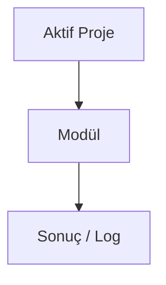

# Campaign Engine

## Bu bölümde ne öğreneceksiniz?

**Campaign Engine** modülünün HIVE içindeki rolünü özet düzeyde öğreneceksiniz.

## Kısa cevap

Uçtan uca SEO kampanya planlayıcı — hedef, blueprint, görev dağıtımı ve ilerleme takibi

## Detaylı açıklama

**Modül ID:** `campaign_engine`

**Grup:** 📝 İçerik & SEO

**API endpoint:** `/api/campaigns/health'`

<!-- AI_UPDATE_SLOT: module_campaign_engine_detail -->

## HIVE içinde nerede kullanılır?

Panel: `/api/campaigns/health` veya klasik modül listesinden **Campaign Engine**.

## Adım adım kullanım

1. Aktif projeyi seçin.
2. Modül sayfasını açın.
3. Gerekli alanları doldurun.
4. Çalıştır ve sonucu Brain'de kontrol edin.

<!-- TODO: modüle özel adımlar -->

## Örnek senaryo

Talon'dan gelen keyword listesini Campaign Engine'e aktararak uçtan uca kampanya yönetimi.

1. Talon'da "kuşadası gece hayatı" araştırması yapın
2. Sonuçları Campaign Engine'e aktarın
3. Dashboard'da yeni kampanya oluşturun (keyword, goal, domain)
4. Blueprint ve task dağıtımını otomatik tamamlayın
5. Haftalık progress'i takip edin ve rapor dışa aktarın

## Görsel alanı

> 📷 Screenshot placeholder: Campaign Engine modül ekranı.

## Akış diyagramı

## En iyi kullanım

<!-- TODO: en iyi kullanım -->

## Yapılmaması gerekenler

<!-- TODO: yapılmaması gerekenler -->

## Yaygın hatalar

<!-- TODO: yaygın hatalar -->

## Sık sorulan sorular

**Bu modül içerik üretir mi?** Ansiklopedi taslağı — detay için Mission Control ve modül health endpoint'ini kontrol edin.

<!-- EKSİK_BİLGİ: campaign_engine derin dokümantasyon -->

## İlgili konular

- Grup: 📝 İçerik & SEO
- [Modül Ansiklopedisi README](../06-modul-ansiklopedisi/README.md)

## Sonraki konu

İlgili modül gruplarına göre Campaign Engine veya Mission Control'a bakın.
