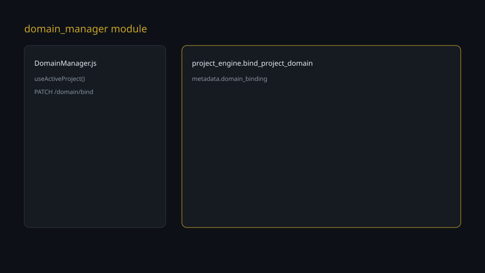
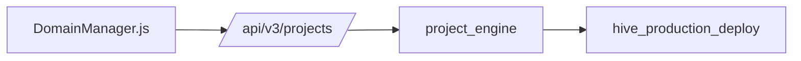

# Domain Manager

## Bu bölümde ne öğreneceksiniz?

Domain Manager modülünün UI akışı, API uçları ve Customer Journey Adım 3 entegrasyonu.

## Kısa cevap

**Modül ID:** `domain_manager`  
**Route:** `/domain-manager`  
**Sayfa:** `DomainManager.js`  
**Backend:** `domain_manager.py` (WP legacy), `project_engine.bind_project_domain` (proje domain)

## Domain nedir?

Üretim sitesinin kök adresi. HIVE'da proje kaydına yazılır ve `domain_binding` ile altyapı hedefine bağlanır.

## HIVE içinde domain neden önemlidir?

Tüm modüller `project_context` üzerinden aktif projenin domain'ini okur. Domain Manager bu değeri görünür kılar ve bind eder.

## Demo projede domain nasıl görünür?

Phoenix Demo — Thiqos Turizm (`prj-161789b6ec`) aktifken banner + `demo.thiqos.com` alanı dolar.

## Domain nasıl eklenir?

Domain Manager → domain input → Kaydet & Bağla (`PATCH` + `POST /domain/bind`).

## Domain nasıl doğrulanır?

**Domain Doğrula** → `GET /domain/status` + proje metadata kontrolü.

## DNS / SSL / Health ne anlama gelir?

Bind `status`, SSL `ssl_status`, nginx `target_type` ve www alias sağ panelde gösterilir.

## Örnek senaryo

Demo tur: Projects'te aktif proje → Domain Manager → mevcut `demo.thiqos.com` → Doğrula → Mission Control CJCR 37.5%.

## Görsel alanı

## API

| Method | Endpoint | Açıklama |
|--------|----------|----------|
| PATCH | `/api/v3/projects/{id}` | Domain alanı güncelle |
| POST | `/api/v3/projects/{id}/domain/bind` | Bind domain |
| GET | `/api/v3/projects/{id}/domain/status` | Durum özeti |

## Akış diyagramı

## Yaygın hatalar

Aktif proje seçilmeden form açılması — empty state gösterilir.

## Troubleshooting

HiveApiErrorCard mesajını okuyun; endpoint ve proje ID doğrulayın.

## Changelog

- **2.0.0**: Proje odaklı Domain Manager UI (Operation Phoenix Step 3).

<!-- AI_UPDATE_SLOT -->
