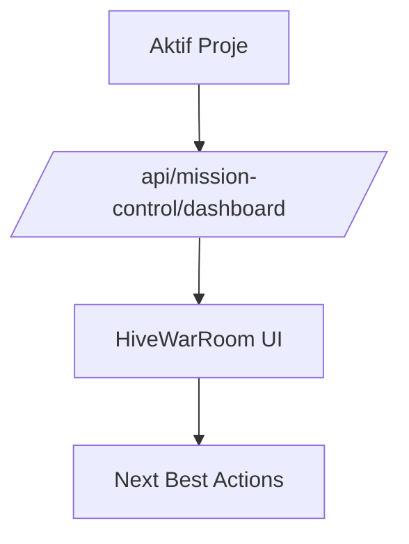

# Mission Control Center

## Bu bölümde ne öğreneceksiniz?

HIVE ana dashboard'unu (War Room / Mission Control) ve demo sırasında nasıl sunulacağını öğreneceksiniz.

## Kısa cevap

**Mission Control** CEO cockpit'tir: kampanya durumu, fırsatlar, authority, provider alarmları ve önerilen aksiyonlar tek ekranda toplanır. Aktif proje zorunludur.

## Detaylı açıklama

**Modül ID:** `mission_control_center`  
**Frontend:** `MissionControlCenter.js` + `HiveWarRoom`  
**Backend:** `/api/mission-control/*`

## HIVE içinde nerede kullanılır?

COMMAND → **Mission Control** — panel açılış ekranı (varsayılan)

## Adım adım kullanım

1. Üst bardan **aktif proje** seçin.
2. Mission Control açılır — metrik kartları yüklenir.
3. **Next Best Actions** panelinden önerilen adımları inceleyin.
4. Bir aksiyonu **Ack** veya **Done** ile işaretleyin.

## Örnek senaryo

Müşteri demo: War Room'da kampanya, keyword fırsatı ve publisher durumu yan yana gösterilir.

## Görsel alanı

> 📷 Screenshot: War Room tam dashboard — metrik grid + next actions.

## Akış diyagramı

## API

| Method | Endpoint | Açıklama |
|--------|----------|----------|
| GET | `/api/mission-control/dashboard` | Özet dashboard |
| GET | `/api/mission-control/dashboard-full` | Tam War Room |
| GET | `/api/mission-control/health` | Health check |

## En iyi kullanım

Demo öncesi aktif projede veri olduğundan emin olun.

## Yapılmaması gerekenler

Aktif proje olmadan müşteriye kırık ürün izlenimi vermeyin — Projects'e yönlendirin.

## Yaygın hatalar

| Sorun | Çözüm |
|-------|--------|
| Aktif proje yok | Projects → seç |
| Dashboard boş | Demo seed / wizard |

## Sık sorulan sorular

**Polling?** 90 sn aralık, gizli sekmede durur.

## İlgili konular

- [Active Project Context](../02-firma-proje-yonetimi/002-active-project-context)
- [Users & Permissions](../02-firma-proje-yonetimi/003-users-permissions)

## Sonraki konu

**Talon** ve **Quality Gate**

<!-- AI_UPDATE_SLOT -->
