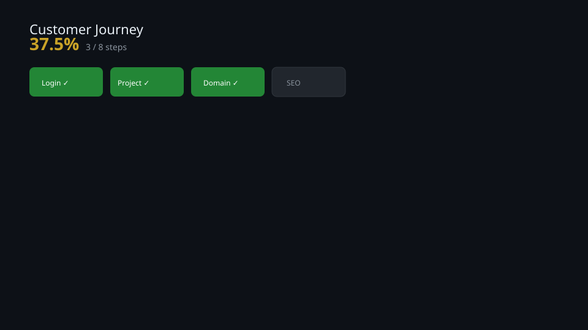
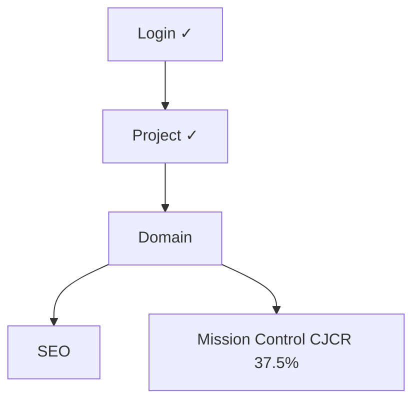

# Customer Journey — Domain Adımı

## Bu bölümde ne öğreneceksiniz?

Operation Phoenix Customer Journey'nin 3. adımı (Domain) ve CJCR 25% → 37.5% geçişini öğreneceksiniz.

## Domain nedir?

Müşteri sitesinin kanonik internet adresi. Demo: `demo.thiqos.com`.

## HIVE içinde domain neden önemlidir?

Login ve Project tamamlandıktan sonra domain, SEO/Authority/Publish modüllerinin ortak site bağlamını oluşturur.

## Demo projede domain nasıl görünür?

1. `python3 scripts/seed-customer-journey-demo.py`
2. Aktif proje: **Phoenix Demo — Thiqos Turizm**
3. Domain Manager'da Phoenix banner + domain alanı

## Domain nasıl eklenir?

Domain Manager → Kaydet & Bağla. Seed script domain'i önceden yazar; kullanıcı güncelleyebilir.

## Domain nasıl doğrulanır?

Domain Doğrula + audit:

```bash
python3 scripts/phoenix-customer-journey-audit.py
```

Beklenen Domain data checks: 5/5 passed, step score 100%.

## DNS / SSL / Health ne anlama gelir?

Mission Control ve Domain Manager sağ paneli bind/SSL/target satırlarını gösterir.

## Örnek senaryo

Satış demosu: "Proje seçtik, şimdi domain'i bağlıyoruz" — 60 saniyede Domain adımı `completed`, CJCR **37.5% (3/8)**.

## Görsel alanı



## API

| Method | Endpoint | Açıklama |
|--------|----------|----------|
| GET | `/api/phoenix/customer-journey` | CJCR + adım durumları |
| POST | `/api/v3/projects/{id}/domain/bind` | Domain bind |
| GET | `/api/v3/projects/{id}/domain/status` | Domain health |

## Akış diyagramı



## Yaygın hatalar

- Domain Manager'da aktif proje yok → önce Projects
- Audit Domain incomplete → academy doc / screenshot / changelog eksik

## Troubleshooting

`roadmap/phoenix-customer-journey-audit.json` içinde `domain` adımı `step_complete: true` olmalı.

## Changelog

- **1.0.0** (2026-06-26): Operation Phoenix Step 3 domain demo-flow dokümanı.

<!-- AI_UPDATE_SLOT -->
